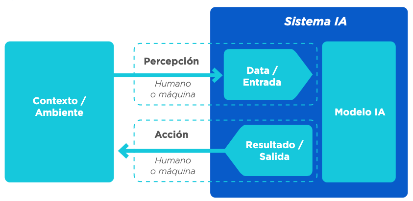
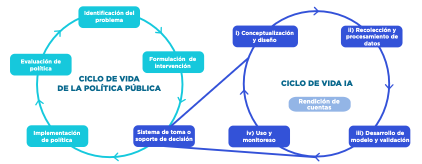
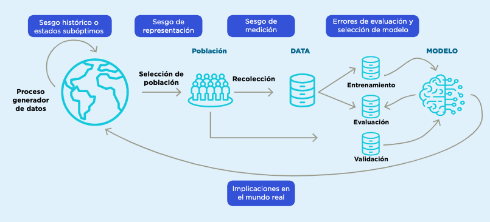

\mainmatter

```{r setup2}
#https://stackoverflow.com/a/26743812/4927395 
library(knitr)
library(ggplot2)

capFigNo <- 1
capFig <- function(x){
      x <- paste0("Figura ",capFigNo,": ",x)
    capFigNo <<- capFigNo + 1
    x
}


knit_hooks$set(plot = function(x, options) {
  paste('<figure><figcaption>',
        options$fig.cap,
        '</figcaption></figure>',
        sep = '')
}) #comment out to restore numbering
```


# Introducción {-}

Los métodos de aprendizaje automático (que para resumir en este documento llamamos ML, por sus siglas en inglés, Machine Learning), como un subconjunto de lo que se conoce como inteligencia artificial, son cada vez más requeridos y utilizados por tomadores de decisiones para informar acciones o intervenciones en varios contextos, desde negocios hasta política pública. En la práctica, estos métodos se han utilizado con diversos grados de éxito y con esto ha aparecido la preocupación creciente de cómo entender el desempeño e influencia positiva o negativa de estos métodos en la sociedad [@barocas; @Suresh]. 

## Machine Learning (ML) y sistemas de toma/soporte de decisiones {-}

La Organización para la Cooperación y el Desarrollo Económico (OECD por sus siglas inglés) describe la IA como un sistema computacional que es capaz de influir en el entorno produciendo un resultado (predicciones, recomendaciones o decisiones) para un conjunto de objetivos determinado. Utiliza datos e insumos de fuentes humanas o sensores para (i) percibir entornos reales y/o virtuales; (ii) abstraer estas percepciones en modelos mediante el análisis de forma automatizada (por ejemplo, con aprendizaje automático), o manual; y (iii) utilizar la inferencia del modelo para formular resultados. Los sistemas de IA están diseñados para funcionar con distintos niveles de autonomía [Adaptado de @oecd2019].  

```{r sistema, fig.cap=capFig("Vista conceptual de un sistema de IA"), echo=FALSE, out.width="90%"}

```

Aunque los métodos de aprendizaje automático no son el único tipo de algoritmos que pueden utilizar los sistemas de IA, sí son los que han tenido más crecimiento de los últimos años. Se trata de un conjunto de técnicas para permitir que un sistema aprenda comportamientos de manera automatizada a través de patrones e inferencias en lugar de instrucciones explícitas o simbólicas introducidas por un ser humano [@oecd2019].

Este manual analiza algunos de los retos más comunes en el uso de las tecnologías de aprendizaje automático para la toma de decisiones o el apoyo a las mismas. Entre ellos se encuentran la detección y mitigación de errores y de sesgos y la evaluación de resultados no deseados por una empresa, institución del sector público o sociedad.  

Se consideran dos arquetipos de inclusión de aprendizaje automático en el proceso de toma de decisiones:^[Estos dos tipos de sistemas son genéricos, es decir, no utilizan necesariamente el aprendizaje automático. Además, estos sistemas pueden ser interactivos y aprender dinámicamente mediante técnicas de aprendizaje por refuerzo, pero en este manual solo consideramos los sistemas no interactivos.]

1. **Sistemas de soporte de decisión:** relacionados con el concepto de inteligencia asistida o aumentada, se utilizan para describir los sistemas en donde la información generada por los modelos de aprendizaje automático se usa como insumo para la toma de decisiones por un ser humano.

2. **Sistemas  de  toma  de  decisión:** estos sistemas se relacionan con el concepto de inteligencia automatizada y autónoma. Las decisiones finales y su consecuente acción se toman sin intervención humana directa. Es decir, el sistema pasa a realizar tareas previamente desarrolladas por un ser humano. En muchos contextos se emplea ADM para denominar estos sistemas por su sigla en inglés: *Automated Decision Making*. 

Para el desarrollo de un sistema de toma/soporte de decisión exitoso basado en aprendizaje automático debe considerarse que existe una gran variedad de técnicas, conocimiento experto del tema y de modelación en general. En este manual no se pretende discutir métodos particulares de aprendizaje automático ni de procesos específicos de ajuste de hiperparámetros –ver, por ejemplo, @ESL; @kuhn; @GelmanHill– sino concentrarse en su evaluación y en los retos más importantes que los sistemas comparten sin importar el tipo de algoritmo o tecnología utilizada. 

Por otra parte, la evaluación de un sistema de aprendizaje no tiene sentido fuera de su contexto. Preguntas como ¿cuál es la tasa de error apropiada? o ¿cuáles sesgos son poco aceptables?, entre otras, solo pueden considerarse y responderse dentro del contexto específico de su aplicación, de los propósitos y motivaciones de los tomadores de decisiones, así como por el riesgo que se presenta en los usuarios finales. Es decir, muchos de los criterios técnicos tienen que entenderse a la luz del problema específico. Los sistemas de toma/soporte de  decisión  nunca  son  perfectos,  pero  si  se  conocen  sus  sesgos  y  sus  limitaciones  incluso un sistema con una precisión baja podría ser útil y utilizarse responsablemente. En el caso contrario, tener un sistema con métricas de evaluación altas no elimina el riesgo de un uso irresponsable si no se entienden sus limitaciones.


```{block2, type='rmdpunto'}
**Objetivos**

- Este manual se centra en el subconjunto de desafíos que están relacionados con los procesos técnicos a lo largo del ciclo de vida de los sistemas de IA utilizados para la toma y soporte de decisiones de política pública.

- Este manual describe cómo diferentes sesgos y deficiencias pueden ser causados por  los  datos  de  entrenamiento,  por  decisiones  en  el  desarrollo  del  modelo  o tomadas durante el proceso de validación y monitoreo. 

```


## Componentes de un sistema de IA para políticas públicas {-} 

### Ciclo de vida de la política pública con IA {-} 

La IA no sustituye a la política pública, pues por sí misma no soluciona el problema social. Su función es asistir proveyendo información para la toma o soporte de decisiones. El ciclo de política pública asistido por IA lo componen las siguientes etapas:  

1. **Identificación del problema:** todo proyecto de IA debe iniciar identificando correctamente el problema social al que la política pública busca impactar, detallando sus posibles causas y consecuencias. 

2. **Formulación de intervención:** se explicita la intervención o política que se está considerando aplicar a ciertas personas, unidades o procesos. Se supone generalmente que se tiene evidencia del beneficio de esa política cuando se aplica a la población objetivo. 

3. **Sistema de toma/soporte de decisión:** una vez definida la intervención, se inicia el ciclo de la IA con el diseño y desarrollo del sistema de toma/soporte de decisión, cuyo resultado se utilizará para focalizar u orientar la intervención elegida en el punto anterior.^[La IA puede utilizarse de distintas maneras. Algunas de ellas pueden ser: i) Sistemas de alerta temprana o detección de anomalías: predicción de deserción escolar o alertas de fenómenos hidrometeorológicos; ii) Sistemas de recomendación o personalización: recomendación para vacantes laborales o personalización de materiales educativos, y iii) Sistemas de reconocimiento, diagnóstico de enfermedades, detección de objetos o reconocimiento biométrico.]

4. **Implementación de política:** se pone en funcionamiento la política pública, ya sea como proyecto piloto y/o con una escala mayor.  

5. **Evaluación de política:** se evalúan la eficacia, la fiabilidad, el costo, las consecuencias previstas y no previstas y otras características  pertinentes de la medida de política en cuestión. Si sus resultados son positivos, se escala o continúa la intervención. 

En paralelo con el ciclo de elaboración de políticas públicas, el desarrollo de un sistema de IA tiene su propio ciclo de vida que incluye las siguientes etapas [@oecd2019]: (i) Conceptualización y diseño; (ii) Recolección y procesamiento de datos; (iii) Desarrollo y validación de modelos, y (iv) Uso y monitoreo. Estas fases suelen tener lugar en forma iterativa y no son necesariamente secuenciales (Figura \@ref(fig:ciclo2)). 

```{r ciclo2, fig.topcaption=TRUE, fig.cap=capFig("Ciclo de vida de las políticas públicas asistido por un sistema de toma/soporte a la toma de decisiones. *Fuente:* Preparado por los autores."), echo=FALSE, out.width="100%"}

```

En la interrelación de estos dos ciclos se generan importantes retos que deben ser evaluados y considerados durante el desarrollo y uso de sistemas de IA robustos y responsables. 

## Retos del ciclo de vida del ML {-} 

Para la construcción de sistemas de toma/soporte de decisión robustos y responsables es necesario efectuar varias tareas: considerar las posibles fuentes de sesgo y deficiencias que pueden causar  los  datos  de  entrenamiento y  problemas y decisiones  en el desarrollo del modelo; definir en forma clara los objetivos de los sistemas y los criterios de justicia que se buscará cumplir; entender las limitantes y errores en el contexto del proyecto específico y establecer medidas de monitoreo de los sistemas para evitar que se produzcan resultados indeseables e inequidad en la toma de decisiones.   

Para lograrlo, este manual presenta los retos y errores usuales en la construcción y aplicación de métodos de aprendizaje automático durante el ciclo de vida de la IA. Cinco secciones describen los problemas más comunes que pueden encontrarse, diagnósticos para detectarlos y sugerencias para mitigarlos: 

1.	**Conceptualización y diseño:** se refiere a la información y criterios necesarios que debe obtener el tomador de decisiones de política pública para iniciar un proyecto de IA.

2.	**Recolección y procesamiento de datos:** se enfoca en el proceso de generación de datos, la selección y el control de las distintas fuentes, y la identificación y mitigación de las deficiencias y sesgos.  

3.	**Desarrollo del modelo y validación:** alude a métodos y principios importantes para construir modelos robustos y validados correctamente. 

4.	**Uso y monitoreo:** es la evaluación del modelo en producción y seguimiento de los principios clave para evitar una degradación inesperada. 

Además, un quinto aspecto, la Rendición de cuentas, es una dimensión transversal en el ciclo de vida del sistema de IA que se refiere a las medidas de transparencia y explicabilidad para promover la comprensión de los mecanismos a través de los cuales un sistema de IA produce un resultado, la reproducibilidad del resultado y la capacidad del usuario para identificar y cuestionar errores o resultados inesperados.  

Los actores de la IA en cada etapa del ciclo de vida deben ser responsables del buen funcionamiento de un sistema de IA en función de sus roles en el desarrollo y del contexto del uso del sistema. 

Se proponen tres herramientas para acompañar el desarrollo del sistema de IA: 

* **Herramienta 1:** [Lista de verificación de IA robusta y responsable.](#herramienta-1-lista-de-verificación-checklist-de-ia-robusta-y-responsable) Esta herramienta consolida las principales preocupaciones por la dimensión de riesgo  del ciclo de vida de IA. Esta lista debe revisarla en forma continua el equipo técnico acompañado por el tomador de decisiones.  
*	**Herramienta 2:** [Perfil de Datos.](#herramienta-2-perfil-de-datos) Este perfil es un análisis exploratorio inicial durante la fase de Recolección y procesamiento de datos del ciclo de vida de IA. Brinda información para evaluar la calidad, integridad, temporalidad, consistencia y posibles sesgos, daños potenciales e implicaciones de su uso.  
* **Herramienta 3:** [Perfil del modelo.](#herramienta-3-perfil-del-modelo) Es la descripción final de un sistema de IA; reporta los principales supuestos, las características más importantes del sistema y las medidas de mitigación implementadas. 

**Recuadro 1.** Fuentes de sesgo un sistema de IA 
```{block2, type='rmdpunto'}
Uno de los conceptos más importantes para los retos del ciclo de vida de la IA es el de los sesgos, pues muchas de las medidas de mitigación y retos que tienen que contemplarse durante el desarrollo de los modelos depende de su correcta comprensión y tratamiento.  Para abordar tempranamente este problema es conveniente tener revisiones específicas en las distintas etapas del ciclo de vida. En cada revisión debe invitarse a los expertos y usuarios finales del sistema que corresponda para verificar y  defender las hipótesis realizadas durante cada etapa. Esto permite enriquecer los puntos de vista, encontrar suposiciones erradas y agregar aspectos no considerados. 

El **error  del sistema** es la diferencia  entre el valor  predicho, resultado del modelo, y el valor real de la variable que se está estimando. Si el error es sistemático en una dirección o en un subconjunto específico de los datos, se llama **sesgo**.^[En modelos de predicción existe una compensación entre la varianza y el sesgo que capta el modelo y su objetivo de generalización de aprendizaje. Por un lado, un modelo con sesgo alto puede crear sistemas que subajustan y aprenden muy poco de los datos observados, pero modelos con alta varianza pueden tener el efecto contrario y sobreajustar, aprendiendo perfectamente los datos de entrenamiento. La sección de ‘Desarrollo de modelos y validación’ de este manual describe estos fenómenos con mayor detalle y ofrece medidas para mitigar sus riesgos.] Por ejemplo, si una balanza siempre pesa un kilo más, está sesgada; o si un valor es siempre menor, como el salario de las mujeres para un trabajo equivalente al que realizan los hombres, la variable salario está sesgada. Por otro lado, cuando el **error** es aleatorio, se llama **ruido**. 

El sesgo de un sistema de IA puede tener implicaciones éticas cuando sus resultados se utilizan para formular políticas públicas que pueden considerarse injustas o perjudiciales para determinados subgrupos de la población. Esta evaluación del sesgo está sujeta a una definición específica de equidad algorítmica, que deben determinar los responsables de las políticas públicas. 

Una definición de equidad algorítmica es una representación matemática de un objetivo de política pública que se incorpora al proceso de selección y ajuste del modelo. Por ejemplo, en algunos casos el objetivo de un sistema puede estar ligado a criterios como la paridad demográfica, la igualdad de posibilidades y tener representación por cuotas, entre otros muchos criterios. En  algunas ocasiones, el cumplimiento de una definición de equidad algorítmica hace imposible el cumplimiento de otra, es decir, pueden ser parcial o totalmente excluyentes. La definición de equidad algorítmica es una tarea de los responsables de las políticas públicas y no de los equipos técnicos. El equipo técnico solo tiene la tarea de realizar validaciones para garantizar su cumplimiento. La sección 3 de este manual analiza en profundidad las diferentes definiciones de equidad algorítmica y sus implicaciones. 

Hay  diferentes **fuentes  de  sesgo** .  Algunos  sesgos  son  intrínsecos  a  los  datos,  como los sesgos históricos o los estados indeseables, que son patrones preexistentes en la sociedad o en los datos recolectados que no es deseable reproducir en el modelo. El **sesgo de representación** se produce cuando hay información incompleta debido a la falta de atributos, al diseño de la muestra o a la ausencia total o parcial de datos de subpoblaciones. Los **sesgos de medición** surgen por la omisión (inclusión) de variables que deberían (no) estar incluidas en el modelo [@Suresh]. Otros sesgos aparecen debido a errores metodológicos: por ejemplo, durante el entrenamiento debido a errores en los procesos de validación, definición de métricas y evaluación de resultados (**sesgo de evaluación**), o **debido a supuestos** erróneos sobre la población objetivo que pueden afectar la definición del modelo; también pueden surgir debido al  mal uso y seguimiento de los modelos, ya sea por interpretaciones inadecuadas de sus resultados o por cambios temporales en los patrones del mundo real o en los métodos de captación de datos. A lo largo de las diferentes secciones de este manual se  presentarán las  principales razones  de estos sesgos y se propondrán diferentes medidas para mitigarlos. 



```

