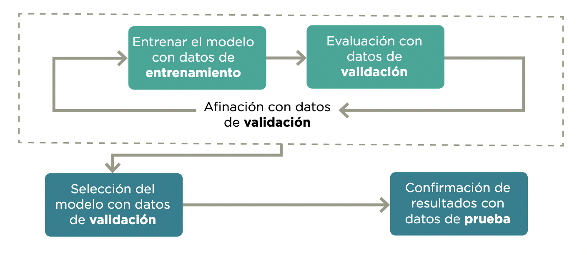
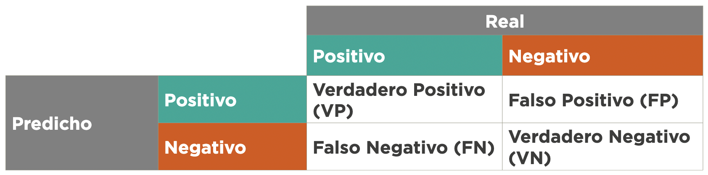
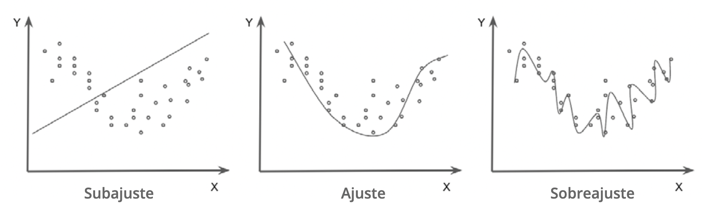

# Desarrollo del modelo y validación

El proceso de desarrollo de un modelo conlleva muchas decisiones que tienen implicaciones en sus resultados. Algunas decisiones pueden llevar a cometer errores metodológicos que generen sesgos o que eviten que el sistema generalice en forma adecuada. Entre estos encontramos fugas de información, sobreajuste y subajuste. 

Además, hay otro grupo de decisiones que no son necesariamente problemas metodológicos que pueden cambiar sustancialmente la forma como se comporta el sistema: ¿cómo elegir entre dos modelos?, ¿qué tipo de errores reportar?, ¿qué definición de justicia algorítmica se elegirá? Al comienzo del manual se comentó que ninguna de estas preguntas tiene sentido fuera del contexto de la aplicación específica. Lo que sí es posible es crear un marco de entendimiento de estos errores para que puedan ser discutidos entre los equipos técnicos y los tomadores de decisiones de política pública. 

En esta sección del manual se exponen retos que aparecen durante los procesos de entrenamiento y validación de los sistemas de soporte y toma de decisión. En este caso la mayoría de los errores se deben a fallos metodológicos en la evaluación y a no plantear en forma correcta el objetivo de ajuste del sistema o las métricas que se busca optimizar. 

## Ausencia o uso inadecuado de muestras de validación 

Los modelos de aprendizaje automático se entrenan principalmente para crear predicciones en casos no observados. De nada sirve evaluar un sistema en su desempeño de predicción de las observaciones con las que se entrenó, pues el sistema podría únicamente memorizar cada respuesta^[Este fenómeno está relacionado con el sobreajuste que se verá más adelante.]. Su utilidad se encuentra en la medida en la que el sistema logra generalizar un aprendizaje para predecir con datos fuera del conjunto de entrenamiento (out-of-sample). La validación generalmente involucra al menos dos muestras (1 y 2), y de preferencia tres: 

1. **Datos de entrenamiento:** subconjunto de los datos utilizados para entrenar el modelo.  
2. **Datos de validación:** subconjunto de los datos con los que se evalúa el entrenamiento en forma iterativa.  
3. **Datos de prueba:** subconjunto de los datos que deben mantenerse ocultos hasta después de seleccionar el modelo y que son usados para confirmar los resultados. 

Para evitar que una partición aleatoria en datos de entrenamiento y validación favorezca o perjudique la evaluación, en general se hace una validación cruzada. Esta consiste en dividir los datos en *k* pedazos, calculando el promedio de *k* evaluaciones, donde los datos de validación son cada uno de los pedazos y los *k*-1 restantes son los datos de entrenamiento. Esto en inglés se llama *k-fold evaluation* y normalmente se escoge *k=5* o *k=10*.

```{r ciclo, fig.topcaption=TRUE, fig.cap="Etapas de evaluación. *Fuente:* Construcción propia", echo=FALSE, out.width="90%"}

```
El primer reto es no tener un proceso de validación apropiado o que incluso sea inexistente. En este caso, los resultados del modelo se presentarían únicamente con el desempeño del conjunto de datos de entrenamiento. Las métricas de desempeño de este conjunto no deberían utilizarse como indicador del potencial comportamiento del modelo para casos nuevos, pues se podría estar sobreestimando su desempeño. 

Una validación exitosa también se relaciona con los criterios de calidad, tales como la completitud y representatividad de la información que se vio en el capítulo anterior, porque si la población objetivo es distinta a la representada por datos utilizados durante el entrenamiento, aunque el proceso de evaluación se haya realizado en forma correcta, es posible tener un comportamiento completamente distinto. 


**Recuadro 9.** Lista de verificación - Ausencia o uso inadecuado de muestras de validación

<div class="cajaAzul">

* (Cuantitativo) ¿Se construyeron las muestras de validación y prueba adecuadamente, considerando un tamaño apropiado que cubra a subgrupos de interés y protegidos y evite fugas de información durante su implementación?

  * La construcción de la muestra de validación debe producirse según un  diseño muestral que permita inferencia a la población objetivo [@lohr]. 

  * La muestra de validación debe cubrir a subgrupos de interés y protegidos, de manera que sea posible hacer inferencia a sus subpoblaciones. Eso incluye tamaños de muestras adecuados según metodología de muestreo [@lohr].

  * Si no está disponible tal muestra, es indispensable un análisis de riesgos y limitaciones de la muestra natural, conducida por expertos y personas que conozcan el proceso que generó esos datos muestrales. 

</div>


## Fugas de información

La  fuga  de  datos  se  produce  cuando  el  modelo  observa  información  adicional  al  conjunto de entrenamiento [@kaufman]. Esta información adicional modifica el proceso de aprendizaje y pone en duda la validación del modelo como forma de estimar el rendimiento de producción del sistema.

Esto ocurre de dos maneras: 

* **Contaminación entrenamiento-validación:** la muestra de entrenamiento recibe fugas de los datos de validación, lo que implica el uso de datos de validación en entrenamiento e invalida la estimación del error de predicción. 

* **Fugas de datos no disponibles en la predicción:** muestras de validación y entrenamiento tienen agrupaciones temporales o de otro tipo que no se conservan en el proceso de entrenamiento y validación. En este caso, entrenamiento y validación reciben fugas de información que no estará disponible en el momento de hacer predicciones.

### Contaminación entrenamiento-validación 

La  contaminación  entrenamiento-validación  se  produce  cuando  todas  o  una  parte de  las muestras de validación o de prueba se utilizan para la construcción de los modelos durante  el  entrenamiento.  Este  error  suele  dar  lugar  a  niveles  de  rendimiento  poco  realistas  en el conjunto de validación, pues el modelo está haciendo predicciones basadas en observaciones que ha visto anteriormente. 

Este error suele producirse al aplicar metodologías de preprocesamiento que agregan y comparten información de la composición de la base de datos a las observaciones individuales: por ejemplo, escalando una variable, creando covariables con promedios o recuentos, metodologías de sobre o submuestreo, etc. Estos procesos deben realizarse después de dividir el conjunto de datos de entrenamiento y validación. 


**Recuadro 10.** Lista de verificación - Contaminación entrenamiento-validación 

<div class="cajaAzul">
(Cuantitativo)  Cualquier  procesamiento  y  preparación  de  datos  de  entrenamiento debe evitar usar los datos de validación o prueba de alguna manera. Debe manten- erse una barrera sólida entre entrenamiento vs. validación y prueba.  Esto incluye re- codificación de datos, normalizaciones, selección de variables, identificación de datos atípicos y cualquier otro tipo de preparación de cualquier variable que vaya a incluirse en los modelos. Esto incluye también ponderaciones o balance de muestras basadas en sobre/sub muestreo. 
 </div>

### Fugas de datos no disponibles en la predicción 

Este  error  se  produce  cuando  se  entrena  un  modelo  con  información  que  no  estará  disponible de la misma manera o con la misma calidad cuando el modelo se ponga en producción. Generalmente, tiene que ver con la temporalidad de los datos o las agrupaciones. En casos más sutiles, este error puede ser difícil de detectar, porque la variable está presente, pero la información se actualiza en forma retroactiva. 
Este tipo de error generalmente produce modelos que parecen muy optimistas, y ocurre de muchas maneras.

Un ejemplo de esto puede verse en las estadísticas de delincuencia y mortalidad. Las denuncias de un robo pueden tardar en aparecer en las bases de datos de las autoridades debido a  procesos  burocráticos  o  administrativos,  y  la  incidencia  observada  en  un  periodo  podría aumentar sistemáticamente con el paso del tiempo. En este ejemplo, la variable objetivo está disponible en la producción, pero puede no estar completa debido a ciertos desfases inherentes a la notificación. Si no se tiene en cuenta este fenómeno durante el entrenamiento y se utilizan datos que ya están completos, la evaluación del modelo puede parecer precisa, pero en producción la precisión de los datos se degradará considerablemente. 

**Recuadro 11.** Fugas de datos no disponibles en la predicción 

<div class="cajaAzul">
El esquema de validación **debe replicar tan cerca como sea posible** el esquema con el cual se aplicarán las predicciones. Esto incluye que hay que replicar:

* Ventanas temporales de observación y registro de variables y ventanas de predicción. 

* Si existen grupos en los datos, considerar si habrá información disponible de cada grupo cuando se haga la predicción, o si será necesario predecir para nuevos grupos.

 </div>


## Modelos de clasificación: probabilidades y clases 

En aprendizaje automático, los algoritmos de clasificación supervisada son sistemas cuyo objetivo es asignar una categoría o etiqueta de clase a las nuevas observaciones.  Se denomina clasificación binaria cuando la variable objetivo tiene dos clases (por ejemplo, clasificar un correo electrónico como spam o no spam), y clasificación multiclase cuando hay más de dos clases (por ejemplo, algoritmo de identificación de especies vegetales). 

### Datos desbalanceados 

En un problema de clasificación, un conjunto de datos desbalanceados se produce cuando la distribución de las observaciones entre las clases conocidas no está distribuida por igual. Estos tipos de conjuntos de datos tendrán una o más clases con muchos ejemplos, denominadas clases mayoritarias, y una o más clases con menos observaciones, denominadas clases minoritarias (por ejemplo, grupos con menos de 1 % de las observaciones totales). Estos últimos grupos presentan dificultades considerables para los modelos de predicción, pues puede haber poca información sobre ellos. 

En datos muy desbalanceados, los predictores de clase pueden tener un rendimiento pobre (por ejemplo, nunca predicen la clase minoritaria), aunque las medidas de rendimiento sean buenas. En particular, si siempre predecimos la clase mayoritaria, la precisión será igual al porcentaje de elementos de esta clase. 

<div class="cajaAzulFuerte">

*Ejemplos*

* Considere que se tiene un millón de datos: 999.000 negativos y 1000 positivos. Puede ser buena idea submuestrear los negativos por una fracción dada (por ejemplo, 10 %)  ponderando  cada  caso  muestreado  por  10  en  el  ajuste  y  el posproceso. 

* Considere que se tiene un millón de datos: 999.950 negativos y 50 positivos. Puede  ser  imposible  discriminar  apropiadamente  los  50  datos  positivos. Construir conjuntos de validación empeora la situación: no es posible validar el desempeño predictivo ni construir un modelo que tenga buen desempeño. 

</div>


**Recuadro 12.** Lista de verificación – Datos desbalanceados  

<div class="cajaAzul">
(Cuantitativo) Hacer **predicciones de probabilidad** en lugar de clase. Estas probabilidades pueden ser incorporadas al proceso de decisión posterior como tales. Evitar puntos de corte estándar de probabilidad como 0.5, o predecir según máxima probabilidad. 

* (Cuantitativo)  Cuando  el  número  absoluto  de  casos  minoritarios  es  muy  reducido, puede ser muy difícil encontrar información apropiada para discriminar esa clase. Se requiere **recolectar más datos de la clase minoritaria**.

* (Cuantitativo)  Submuestrear  la  clase  dominante  (ponderando  hacia  arriba  los  casos para no perder calibración) puede ser una estrategia exitosa para reducir el tamaño de los datos y el tiempo de entrenamiento sin afectar el desempeño predictivo. 

* (Cuantitativo) Replicar la clase minoritaria, para balancear mejor las clases (sobremuestreo). 

* (Cuantitativo)  Algunas  técnicas  de  aprendizaje  automático  permiten  ponderar  cada clase por un peso distinto para que el peso total de cada clase quede balanceado. Si esto es posible, es preferible a sub o sobremuestreo. 

</div>


### Puntos de corte arbitrarios 

En los problemas de clasificación para la toma de decisiones se recomienda utilizar algoritmos de clasificación probabilística en lugar de clasificar la observación solo con su clase más probable. El resultado de un algoritmo de clasificación probabilística es una distribución de probabilidad sobre el conjunto de clases. Estos métodos pueden proporcionar información al responsable de toma de decisiones sobre la incertidumbre relativa a la clasificación. 

Para tomar la decisión sobre si la observación debe clasificarse como positiva o negativa, el equipo técnico debe elegir el umbral a partir del cual la observación se clasifica como perteneciente a cada clase. A menudo se acepta erróneamente un punto de corte de 0,5 para las clasificaciones binarias, pues es el valor por defecto de muchos modelos de aprendizaje automático. Esta decisión puede tener importantes implicaciones si se toma fuera del contexto del problema en cuestión, por lo que es importante que se discuta y se seleccione teniendo en cuenta los tipos de errores y sus implicaciones. 

**Recuadro 13.** Lista de verificación – Puntos de corte arbitrarios  

<div class="cajaAzul">
* (Cuantitativo) El uso de **algoritmos de clasificación probabilística** es más adecuado para que la toma de decisiones incorpore la incertidumbre con respecto a la clasificación.

* (Cuantitativo) Evitar los puntos de corte de probabilidad estándar, como el 0,5. Elegir una  interpretación  óptima  de  las  probabilidades  predichas,  analizando  las  métricas de error.
 </div>


### Idoneidad de las métricas de evaluación 
En problemas de clasificación, los puntos de corte se toman con criterios relacionados con el contexto de la decisión. La mayoría se construye mediante el análisis de la matriz de confusión de clasificación. 



Los errores de un modelo de clasificación pueden dividirse en falsos positivos y falsos negativos. Un falso positivo es una observación para la que el modelo predice incorrectamente la clase positiva. Y un falso negativo es una observación para la que el modelo predice incorrectamente la clase negativa. Estas métricas pueden combinarse de diferentes maneras en función del caso de uso y del objetivo de la política social. Las métricas más utilizadas son: 


1. **Exactitud (Accuracy)**: una  de  las  métricas  más  utilizadas  para  evaluar  los  modelos  de clasificación es la fracción de las predicciones que el modelo tuvo correctas:   

$$\text{Exactitud} = \frac{\text{ VP+VN }}{\text{ VP + VN + FP + FN}}$$

2. **Precisión**: fracción de aquellos clasificados como positivos por el modelo que en reali - dad eran positivos:  

$$\text{Precision} = \frac{\text{VP}}{\text{VP+FP}}$$

3. **Sensibilidad (Recall)**: fracción de positivos que el modelo clasificó correctamente: 


$$\text{Sensibilidad} = \frac{\text{VP}}{\text{VP+FN}}$$
3. **Especificidad**: fracción de negativos que el modelo clasificó correctamente:  
 


$$\text{Especificidad} = \frac{\text{VN}}{\text{VN+FP}}$$
Es necesario tener en cuenta el contexto del problema a la hora de definir los criterios para evaluar los modelos de clasificación. Por ejemplo, si el modelo clasifica la prevalencia de una enfermedad mortal, el costo de no diagnosticar (falso negativo) es mucho mayor que el costo de enviar a una persona sana a hacerse más pruebas (falso positivo). En otras palabras, dependiendo de la aplicación, el costo de los falsos negativos puede ser muy diferente del costo de los falsos positivos. Por ello, se recomienda el uso del análisis costo-beneficio, porque compara el resultado del modelo en el contexto de la toma de decisiones. 

Estos criterios también pueden ser engañosos en función de la composición de la base de datos de entrenamiento y evaluación. Por ejemplo, cuando se utilizan datos desbalanceados, una precisión de 95 % puede significar en realidad un rendimiento inferior del modelo. Las soluciones parciales a este problema incluyen el uso de medidas que combinan la precisión y la sensibilidad, como la métrica F1 o la curva Precision-Recall , que pueden ayudar a analizar el equilibrio entre los verdaderos positivos y los falsos positivos en el contexto de la aplicación. 

**Recuadro 14.** Lista de verificación - Idoneidad de las métricas de evaluación 

<div class="cajaAzul">
* (Cualitativo) ¿Se cuestionaron las implicaciones de los diferentes tipos de errores para el caso de uso específico, así como la forma correcta de evaluarlos?

* (Cualitativo) ¿Se explicó en forma clara las limitantes del modelo, identificando tanto los  falsos  positivos  como  falsos  negativos  y  las  implicaciones  que  una  decisión  del sistema tendría en la vida de la población beneficiaria?

* (Cuantitativo) ¿Se implementó un análisis costo-beneficio del sistema contra el statu quo u otras estrategias de toma/soporte de decisión (cuando es posible)? 

</div>

## Sub y sobreajuste 

Sub y sobreajuste ocurren cuando la información predictiva en los datos se usa de manera poco apropiada para el objetivo final del aprendizaje automático, que es la generalización del aprendizaje y su uso en conjuntos de datos no observados en el entrenamiento. 

* El **sobreajuste** se produce cuando el modelo memoriza las particularidades de los datos de entrenamiento, pero es incapaz de generalizar a ejemplos no vistos. Un modelo demasiado complejo para los datos disponibles tiende a captar características no informativas como parte de la estructura predictiva. Esto se refleja a menudo en un modelo que funciona muy bien con los datos de entrenamiento, pero que tiene un rendimiento pobre en el conjunto de datos de validación.

* El **subajuste** se produce cuando el modelo es incapaz de funcionar bien con los datos de entrenamiento o de generalizar con los nuevos datos. Esto ocurre cuando las características individuales de las observaciones se agrupan en exceso y se les da poca importancia. Un modelo poco ajustado tiende a ignorar los patrones de la estructura predictiva. Esto se refleja en errores sistemáticos e identificables, por ejemplo, sub/sobre predicción sistemática para ciertos grupos o valores de las variables de entrada. 

```{r sub-sobre-ajuste,fig.topcaption=TRUE, fig.cap="Sub y sobreajuste. *Fuente:* Preparado por los autores", echo=FALSE, out.width="90%"}

```

**Recuadro 15.** Lista de verificación - Sub y sobreajuste 

<div class="cajaAzul">
* (Cuantitativo)  Sobreajuste:  debe  evitarse  modelos  cuya  brecha  validación  -  entrenamiento sea grande (indicios de sobreajuste). De ser necesario, debe afinarse métodos para moderar el sobreajuste como regularización, restricción del espacio funcional de modelos posibles, usar más datos de entrenamiento o perturbar los datos de entrenamiento, entre otros [@ESL].

* (Cuantitativo)  Subajuste:  deben  revisarse  subconjuntos  importantes  de  casos  (por ejemplo, grupos protegidos) para verificar que no existan errores sistemáticos indeseables.

 </div>

## Errores no cuantificados y evaluación humana 

En muchos casos, existirán aspectos del modelo que no son medidos por las métricas de desempeño que se han escogido. 

Por  ejemplo,  en  un  sistema  de  búsqueda  en  documento  que,  aunque  tenga  buen  desempeño de validación en las métricas, seleccione documentos que tiendan a ser demasiado cortos, produzcan resultados poco útiles o imparciales para búsquedas particulares, o prefiera documentos  de  tipo  promocional  o  propagandístico.  Las  razones  pueden  ir  desde  errores de preprocesamiento (algunos atributos mal calculados) hasta la selección de atributos para hacer las predicciones que consideran solo una parte del problema.

### Fallas no medidas por el modelo 

Algunos algoritmos producen resultados de baja calidad que escapan a la evaluación de las métricas de validación. Estos modelos pueden tener un bajo rendimiento cuando se ponen en producción. Las razones para ello son, entre otras, las siguientes: 

* Errores de preprocesamiento en el momento de calcular predicciones. 

* Tratamiento de los datos que excluyen métricas importantes para hacer predicciones de calidad o no injustas. 

* Ausencia de métricas que midan cierto tipo de errores particulares graves.

Este puede ser un problema difícil, pues por su naturaleza son errores no visibles o medibles directamente. Es necesario descubrir estos sesgos o errores fuera del contexto técnico de evaluación y, de ser posible, incluir métricas adicionales de evaluación que consideren estos problemas. 

**Recuadro 16.** Lista de verificación - Fallas no medidas por el modelo  

<div class="cajaAzul">
* (Cualitativo) ¿Se realizó una evaluación humana con expertos del caso de uso para buscar sesgos o errores conocidos? (Por ejemplo, pueden usarse paneles de revisores que examinen predicciones particulares y consideren si son razonables o no. Estos paneles deben balancearse en cuanto al tipo de usuarios que se prevén, incluyendo tomadores de decisiones, si es necesario). 

</div>

## Equidad y desempeño diferencial de predictores

Métodos basados en aprendizaje automático pueden producir resultados injustos o discrim- inatorios para subgrupos [@boulamwini], [@barocas], [@bolukbasi]. Estos resultados pueden ocasionarlos todos los retos antes mencionados, tanto de la fuente y manejo de los datos como de errores en el diseño del modelo. 

Ejemplos de desempeño diferencial e inequidad incluyen distintas tasas de aceptación para recibir beneficios en distintos grupos o errores de detección en rostros humanos que son diferentes dependiendo de la raza. 

Es importante recordar que la evaluación de los resultados de un sistema de toma/soporte de  decisiones  se  realiza  teniendo  en  cuenta  los  objetivos  del  tomador  de  decisiones,  que pueden  ser  distintos  e  incluso  contradictorios  a  los  objetivos  desde  el  punto  de  vista  del problema de aprendizaje automático. Por ejemplo, un tomador de decisiones podría sacrificar el desempeño global de un modelo para mejorar el desempeño del modelo en un subgrupo, aunque este subgrupo sea pequeño en comparación con la población en su conjunto (por ejemplo, una acción afirmativa para corregir alguna discriminación social existente). 

Aunque el análisis de las implicaciones éticas en los modelos de aprendizaje automático y la relación que estas tienen con una definición de justicia es aún un campo de estudio abierto, existe una importante literatura que busca implantar definiciones matemáticas de equidad en  los  modelos  para  describir  su  imparcialidad  o  discriminación  entre  subgrupos  y  tomar decisiones que mitiguen resultados no deseados. 

### Definición de justicia y equidad algorítmica

Lo  que  se  entiende  por  “justicia”  puede  cambiar  según  una  cultura  o  tradición  y  también puede ser específico de un proyecto o problema de política pública. Por ejemplo, en algunos casos las políticas buscan la inclusión social a través de acciones afirmativas –como las cuotas de diversidad y las políticas de reparación– mientras que en otros casos estas políticas se basan simplemente en argumentos regionales o territoriales. Estos criterios deben integrarse en el proceso de diseño, en el análisis de los datos de formación, durante el proceso de evaluación de errores y en la salida del sistema. Este proceso puede dividirse en dos importantes etapas:

* **Definición de justicia algorítmica:** representación matemática de una definición de justicia específica que se incorpora en el proceso de ajuste y selección del modelo. Es importante tomar en cuenta que estas definiciones pueden ser excluyentes, es decir, satisfacer una podría implicar no satisfacer las demás [@verma].

-	**Inequidad algorítmica:** fallas técnicas en los modelos que producen disparidad de resultados para grupos protegidos que deben evaluarse según la definición de justicia algorítmica determinada en el punto anterior (podría ser más de una). 

El objetivo del modelador es establecer lineamientos para evitar que deficiencias en los modelos  produzcan  disparidades  indeseables  según  los  distintos  subgrupos  asociados  a  una variable protegida (por ejemplo, género, raza o nivel de marginación). Para ello, es necesario seleccionar de antemano una definición de justicia algorítmica. Algunas de las más utilizadas son las siguientes (aunque pueden definirse otras, dependiendo del problema particular y los objetivos de los tomadores de decisiones): 

**_(1) Omisión de variables protegidas _**

Una  estrategia  muy  cuestionada  para  prevenir  disparidades  entre  los  grupos  de  una  variable  protegida $A$  es  ignorar  la  variable. En  este  proceso  se  pretende  eliminar  la  posibilidad de disparidad no incluyendo la variable $A$ en el proceso de construcción de predictores. Este enfoque NO resuelve el problema porque: 

* Típicamente existen otros atributos asociados a $A$ que pueden producir resultados similares, aunque $A$ no se considere (por ejemplo, zona geográfica o código postal y nivel socioeconómico). 

* Puede haber razones importantes para incluir a $A$ en los modelos predictivos. Por ejemplo, en el caso de presión arterial, existen variaciones en los grupos raciales ($A$) en cuanto a predisposición a presión alta [@hipertension]; por lo tanto, un modelo que evalúe riesgo sería más preciso y adecuado si incluye la variable $A$.


**_(2) Paridad demográfica_** 

La paridad demográfica establece, por su parte, que la proporción de cada segmento de una clase protegida $A$ (por ejemplo, el género o ciertos rangos de edad) debe obtener un resultado positivo  en  una  misma  proporción  (como,  por  ejemplo,  la  asignación  de  becas  escolares). Esto es poco deseable por sí mismo: por ejemplo, si quisiéramos construir un clasificador para cierta enfermedad, necesitaríamos considerar que es posible que mujeres y hombres fueran afectados de manera distinta. Sin embargo, la paridad demográfica puede ser un objetivo de los tomadores de decisiones y eso debe tenerse en cuenta en el momento de tomar la decisión asociada a la predicción. 

**_(3) Equidad de posibilidades_**

El  concepto  de  equidad  de  posibilidades [@hardt]  es  uno  menos  dependiente  de  los objetivos de los tomadores de decisiones; se refiere al desempeño predictivo a lo largo de distintos grupos definidos por una variable protegida $A$  [@verma]. Si $Y$ es la variable que queremos predecir, y $\hat{Y}$ es nuestra predicción, decimos que nuestra predicción satisface equidad de posibilidades cuando $\hat{Y}$ y $A$ son independientes, dado el valor verdadero $Y$. 


Esto quiere decir que $A$ no debe influir en la predicción cuando conocemos el valor verdadero $Y$, o dicho de otra
manera, la pertenencia o no pertenencia al grupo protegido $A$ no debe influir en la probabilidad de la clasificación. 

Se considera entonces que predictores que se alejan mucho de este criterio son susceptibles de incluir disparidades asociadas a la variable protegida $A$. Una implicación de este criterio es que, bajo el supuesto de equidad de posibilidades, las tasas de error predictivo sobre cada subgrupo de $A$ son similares y para clasificación binaria las tasas de falsos positivos y de fal- sos negativos son similares.

Por ejemplo, supongamos que quiere crearse un sistema para la selección de beneficiarios de una beca escolar para una universidad reconocida. La institución define como variable protegida la pertenencia a una comunidad indígena (que supondremos en este caso que toma dos valores: se autodenomina indígena o no se autodenomina indígena). El predictor satisface equidad de posibilidades cuando tanto la tasa de falsos positivos como la de falsos negativos son iguales para personas indígenas como para personas que no lo son.

**_(4) Justicia contrafactual_** 

EEsta medida considera que un predictor es “justo” si su resultado sigue siendo el mismo cuando se toma el valor del atributo protegido y se cambia a otro valor posible del atributo protegido (como, por ejemplo, introducir un cambio de raza, género u otra condición).

En la práctica no existe una respuesta única ni una medida de justicia algorítmica que funcione para todos los problemas. En la mayoría de los casos buscar el cumplimiento de una implica no cumplir totalmente con las demás, por lo que su elección debe hacerse en el contexto del problema y deben justificarse sus razones. Equidad de oportunidad muchas veces es un criterio aceptable, que introduce criterios de justicia algorítmica permitiendo también optimizar otros resultados deseables.

**Recuadro 17.** Lista de verificación - Definición de justicia y equidad algorítmicas

<div class="cajaAzul">
* (Cualitativo)  Identificar  grupos  o  atributos  protegidos.  Por  ejemplo:  edad,  género, raza, nivel de marginación, etc. 

* (Cualitativo) ¿Se definió con expertos y tomadores de decisiones la medida de justicia algorítmica que va a usarse en el proyecto? 

* (Cuantitativo) Cuando existen atributos protegidos debe evaluarse qué tanto se alejan las predicciones de la definición de justicia algorítmica elegida. 

* (Cuantitativo)  Posprocesar  adecuadamente  las  predicciones,  si  es  necesario,  para lograr el criterio de justicia algorítmica elegido (por ejemplo, equidad de posibilidades, oportunidad). 

* (Cuantitativo) En el caso de clasificación, puntos de corte para distintos subgrupos pueden ajustarse para lograr equidad de oportunidad. 

* (Cuantitativo) Recolectar información más relevante de subgrupos protegidos (tanto casos como características) para mejorar el desempeño predictivo en grupos minoritarios. 

</div>