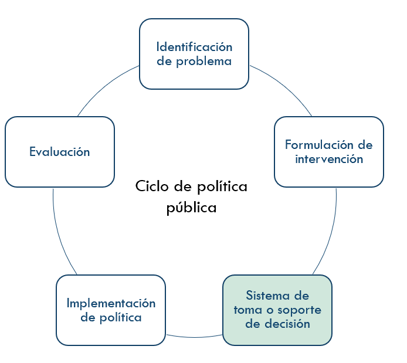
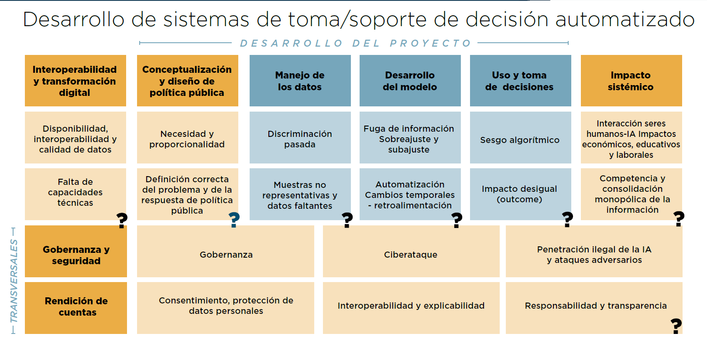

\mainmatter

# Introducción {#intro}

Los métodos de aprendizaje automático, como un subconjunto de lo que se conoce como inteligencia artificial, que para resumir en este documento llamamos ML (por sus siglas en inglés) son cada vez más requeridos y utilizados por tomadores de decisiones para informar acciones o intervenciones en varios contextos, desde negocios hasta política pública. En la práctica, estos métodos se han utilizado con diversos grados de éxito, y con esto ha aparecido la preocupación creciente de cómo entender el desempeño e influencia positiva o negativa de estos métodos en el contexto de la toma de decisiones ([@Suresh], [@barocas]).


```{block2, type='rmdpunto'}

¿Cuándo estos métodos de ML nos llevan a tomar decisiones que son costosas, riesgosas o pueden inducir estados no deseados (por ejemplo, discriminatorios o injustos) en los sistemas y decisiones en donde se utilizan?

```


## IA y toma de decisiones

La OCDE describe a los sistemas de soporte de decisión como un “sistema computacional que puede, para un determinado conjunto de objetivos definidos por humanos, hacer predicciones y recomendaciones o tomar decisiones que influyen en entornos reales o virtuales.” Y que están diseñados para operar con distintos niveles de autonomía (OECD, 2019).

En este manual se pretende discutir los problemas más comunes en el uso del aprendizaje automático (ML) como parte de un sistema de toma/soporte de decisión como detectar errores de implementación, sesgos, y evaluar la posibilidad de resultados indeseables para la sociedad, una compañía o institución particular. 

Aunque los métodos de aprendizaje automatizado son el único tipo de algoritmos que pueden utilizar los sistemas de IA, sí son los que han tenido más crecimiento de los últimos años. Se trata de un conjunto de técnicas para permitir que las máquinas aprendan de manera automatizada a través de patrones e inferencias en lugar de a través de instrucciones explícitas o simbólicas (OECD, 2019). 

Consideramos dos arquetipos de inclusión de aprendizaje automático en el proceso 
de toma de decisiones:

1. **Sistemas de soporte de decisión**: Resultados del aprendizaje automático son insumos para decisiones que se toman de forma más tradicional. Por ejemplo, decisiones acerca del funcionamiento o refinación de un programa social, pronósticos de variables clave para planeación.

2. **Sistemas de toma de decisión**: Las decisiones se toman automáticamente, sin intervención humana directa. Por ejemplo, inclusión de individuos en programas sociales, u otorgamiento de créditos al consumo.


El primer punto que se tiene que presente y es guía de este documento es que en la construcción y en los métodos particulares de los sistemas de aprendizaje automático existen una gran variedad de técnicas, conocimiento experto del tema y de modelación en general que se deben de considerar para el desarrollo de un sistema de soporte/toma de decisión exitoso. 

En la construcción y en los métodos particulares de los sistemas de aprendizaje automático existen una gran variedad de técnicas, conocimiento experto del tema y de modelación en general que se deben de considerar para el desarrollo de un sistema de soporte/toma de decisión exitoso. 
En esta guía no pretende discutir métodos particulares de aprendizaje automático (ver por ejemplo @ESL, @kuhn, @GelmanHill).

Por otra parte, la evaluación de un sistema de aprendizaje automatizado no tiene sentido fuera de su contexto, preguntas como: ¿Cuál es una tasa de error apropiado? o ¿cuáles son sesgos poco aceptables?, entre otras, sólo pueden considerarse dentro del contexto específico de su aplicación y de los propósitos y motivaciones de los tomadores de decisiones. Esto quiere decir que, aunque mucha de la discusión se concentra en aspectos técnicos, métricas particulares de desempeño o métodos de ML, al final ninguna de estas discusiones tiene sentido fuera del contexto de **la decisión** que se quiere tomar


```{block2, type='rmdpunto'}
**Principio guía 1**

- El manual se concentrará en la **evaluación** técnica de los sistemas de toma/soporte de decisión durante su ciclo de vida, desde el procesamiento de datos hasta la evaluación y monitoreo.

- La evaluación sólo tiene sentido en términos del contexto de la decisión, y de los
**resultados que son deseables para los tomadores de decisiones**, instituciones o compañías involucradas.

```


## Componentes de un sistema de IA y retos

La IA no sustituye a la política pública, su función es unicamente asistir en la toma de decisiones proveyendo información para segmentar, clasificar, asociar o predecir. El ciclo de política pública asistido por IA está compuesto por las siguientes etapas: 

1. **(Identificación del problema)** Todo proyecto de IA debe iniciar identificando correctamente el problema social en el que la política pública busca impactar, identificando sus posibles causas y consecuencias. 
2. **(Formulación de intervención)**  Se formula la intervención o política que se está considerando aplicar a ciertas personas, unidades o procesos. Supondremos generalmente que se tiene evidencia del beneficio de esa política cuando se aplica a la población objetivo.
3. **(Sistema de toma/soporte de decisión)** Una vez definida la intervención, se pueden utilizar entonces sistemas de toma/soporte de decisión para estimar o predecir variables desconocidas de la población.  Ejemplos de esto puede ser:
  - a.	Sistemas de alerta temprana. Por ejemplo, actividad criminal, fenómenos meteorológicos o enfermedades.
  - b.	Predicción del desempeño de alumnos en un sistema educativo, Modelos de generación de scoring para créditos
  - c.	Sistemas de recomendación para vacantes laborales o personalización de materiales educativos.

4. **(Implementación de política)** Lorem

5. **(Evaluación de política)** Lorem



El objetivo es entonces entender cómo la calidad, tipo de predicciones o estimaciones pueden influir en la toma de decisiones, y más adelante, en el resultado global de la intervención.


```{block2, type='rmdpunto'}
**Principio guía 2**

Este manual, se concentra en el **Sistema de toma/soporte de decisión**, y cómo deficiencias o lagunas en el proceso de validación puede producir resultados indeseables en la **toma de decisiones**.
```

\pagebreak

## Ciclo de vida de IA y retos
El ciclo de desarrollo de un sistema de soporte de decisión con IA normalmente implica cuatro fases: i) La fase de diseño, ii) datos y modelos es una secuencia que abarca la planificación, recolección y procesamiento de datos y construcción e interpretación de modelos. A esto le sigue una etapa de verificación y validación, el despliegue y monitoreo. Estas fases suelen tener lugar de manera iterativa y no son necesariamente secuenciales. (OECD, 2019).


Este libro describe en cuatro secciones los problemas más comunes dentro del ciclo de vida de la IA, presenta diagnósticos para detectarlos y sugerencias para mitigarlos:

1. **Fuente y manejo de datos**: que se refieren principalmente a deficiencias, sesgos y al proceso que genera los datos utilizados (Ntoutsi et al. 2020). 
2. **Desarrollo de modelos**: que se refiere a métodos y principios importantes para construir modelos robustos y validados correctamente.
3. **Uso y monitoreo**: que se refiere a la interpretación del modelo, evaluación una vez puesto en producción y principios de monitoreo para evitar consecuencias inesperadas.
4. **Rendición de cuentas**: que se refiere al entendimiento o la capacidad de explicar cómo es que métodos automatizados toman ciertas decisiones.




