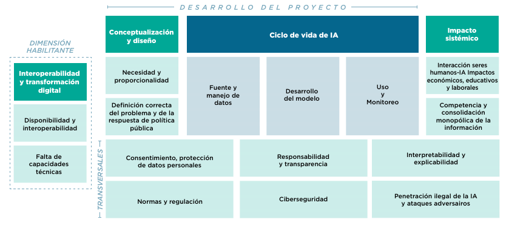
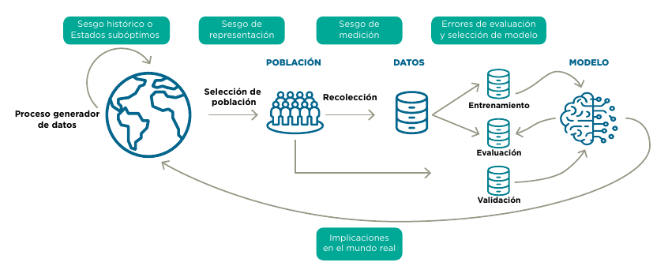

\mainmatter

# Introducción {#intro}

Los métodos de aprendizaje automático, como un subconjunto de lo que se conoce como inteligencia artificial (que para resumir en este documento llamamos ML, por sus siglas en inglés, *Machine Learning*) son cada vez más requeridos y utilizados por tomadores de decisiones para informar acciones o intervenciones en varios contextos, desde negocios hasta política pública. En la práctica, estos métodos se han utilizado con diversos grados de éxito, y con esto ha aparecido la preocupación creciente de cómo entender el desempeño e influencia positiva o negativa de estos métodos en la sociedad (@barocas) (@Suresh).

## ML y sistemas de toma/soporte de decisiones

La OCDE describe a los sistemas de soporte de decisión como un “sistema computacional que puede, para un determinado conjunto de objetivos definidos por humanos, hacer predicciones y recomendaciones o tomar decisiones que influyen en entornos reales o virtuales.” Y que están diseñados para operar con distintos niveles de autonomía  (@oecd2019).

En este manual se pretende discutir los problemas más comunes en el uso del aprendizaje automático (ML) como parte de un sistema de toma/soporte de decisión, como detectar errores de implementación, sesgos, y evaluar la posibilidad de resultados indeseables para la sociedad, una compañía o institución particular. 

Aunque los métodos de aprendizaje automático no son el único tipo de algoritmos que pueden utilizar los sistemas de IA, sí son los que han tenido más crecimiento de los últimos años. Se trata de un conjunto de técnicas para permitir que un sistema aprenda comportamientos de manera automatizada a través de patrones e inferencias en lugar de instrucciones explícitas o simbólicas introducidas por un humano (@oecd2019). 

Se consideran dos arquetipos de inclusión de aprendizaje automático en el proceso de toma de decisiones:^[Estos dos tipos de sistemas son genéricos, es decir no necesariamente usan aprendizaje automático. También estos sistemas pueden ser interactivos y aprender en forma dinámica usando técnicas de aprendizaje por refuerzo, pero en este documento sólo consideramos sistemas no interactivos.]

1. **Sistemas de <ins>soporte</ins> de decisión**: Relacionado al concepto de inteligencia asistida o aumentada, se utiliza para describir los sistemas en donde la información generada por los modelos de aprendizaje automático se utiliza como insumo para la toma de decisiones por un humano.

2. **Sistemas de <ins>toma</ins> de decisión**: Relacionada con el concepto de inteligencia automatizada y autónoma. Las decisiones finales y su consecuente acción se toman sin intervención humana directa. Es decir, el sistema pasa a realizar tareas previamente desarrolladas por un humano. En muchos contextos se usa ADM para denominar estos sistemas por su sigla en inglés: *Automated Decision Making*.

Para el desarrollo de un sistema de toma/soporte de decisión exitoso basado en aprendizaje automático se debe considerar que existe una gran variedad de técnicas, conocimiento experto del tema y de modelación en general. En este manual no se pretende discutir métodos particulares de aprendizaje automático ni de procesos específicos de ajuste de hiper-parámetros, ver por ejemplo (@ESL), (@kuhn), (@GelmanHill), sino concentrarse en su evaluación y en los retos más importantes que los sistemas comparten sin importar el tipo de algoritmo o tecnología utilizada.

Por otra parte, la evaluación de un sistema de aprendizaje automatizado no tiene sentido fuera de su contexto, preguntas como: ¿cuál es una tasa de error apropiado? o ¿cuáles son sesgos poco aceptables?, entre otras, sólo pueden considerarse y ser respondidas dentro del contexto específico de su aplicación, de los propósitos y motivaciones de los tomadores de decisiones, así como por el riesgo que se presenta en los usuarios finales. Es decir, muchos de los criterios técnicos tienen que ser entendidos bajo la luz del problema específico, los sistemas de toma/soporte de decisión nunca son perfectos, pero si se conocen sus sesgos y sus limitaciones incluso un sistema con una precisión baja podría ser útil y ser utilizado responsablemente. En el caso contrario, el tener un sistema con métricas de evaluación altas no elimina el riesgo de un uso irresponsable si no se entienden sus limitaciones.


```{block2, type='rmdpunto'}
**Principio guía**

- Este manual se concentra en el subconjunto de retos que están relacionados a procesos técnicos a lo largo del ciclo de vida de la IA como sistema de toma/soporte de decisión. Su objetivo es describir cómo distintos sesgos y deficiencias pueden ser causadas por los datos de entrenamiento, problemas y decisiones en el desarrollo del modelo, en el proceso de validación o monitoreo que pueden producir resultados indeseables e inequidad en la toma de decisiones.

- La evaluación sólo tiene sentido en términos del contexto de la decisión, y de los resultados que son deseables para los tomadores de decisiones, instituciones o compañías involucradas.

```


## Componentes de un sistema de IA para políticas públicas

### Ciclo de vida de la política pública con IA

La IA no sustituye a la política pública ya que por sí misma no soluciona el problema social, su función es asistir proveyendo información para la toma o soporte de decisiones. El ciclo de política pública asistido por IA está compuesto por las siguientes etapas: 

1. **Identificación del problema:** Todo proyecto de IA debe iniciar identificando correctamente el problema social en el que la política pública busca impactar, identificando sus posibles causas y consecuencias.  
2. **Formulación de intervención:** Se formula la intervención o política que se está considerando aplicar a ciertas personas, unidades o procesos. Supondremos generalmente que se tiene evidencia del beneficio de esa política cuando se aplica a la población objetivo.    
3. **Sistema de toma/soporte de decisión:** Una vez definida la intervención, se inicia el ciclo de la IA con el diseño y desarrollo del sistema de toma/soporte de decisión, cuyo resultado será utilizado para focalizar u orientar la intervención elegida en el punto anterior.^[La IA se puede utilizar de distintas maneras, algunas de ellas pueden ser: i) Sistemas de alerta temprana o detección de anomalías: predicción de deserción escolar o alertas de fenómenos hidrometeorológicos; ii) Sistemas de recomendación o personalización: recomendación para vacantes laborales o personalización de materiales educativos; y iii) Sistemas de reconocimiento, diagnóstico de enfermedades, detección de objetos o reconocimiento biométrico.]
4. **Implementación de política:** Se implementa la política pública ya sea como proyecto piloto y/o con una escala mayor.  
5. **Evaluación de política:** Se evalúa la eficacia, la fiabilidad, el costo, las consecuencias previstas y no previstas y otras características pertinentes de la medida de política en cuestión, si sus resultados son positivos se escala o continúa la intervención.

```{r ciclo2, fig.cap="Ciclo de diseño de política pública. Construcción propia.", echo=FALSE}
knitr::include_graphics("images/ciclo-politica.png")
```

Paralelamente al ciclo de política pública, el desarrollo de un sistema de IA tiene su propio ciclo que normalmente incluye las siguientes fases: i) Planeación y diseño, ii) recolección, conocimiento y preparación de datos, iii) modelado, iv) evaluación e implementación y vi) monitoreo. Estas fases suelen tener lugar de manera iterativa y no son necesariamente secuenciales. 

En la interrelación de estos dos ciclos se genera un importante grupo de retos para obtener una IA robusta y responsable que tienen que ser evaluados y considerados durante el desarrollo y uso de estos sistemas (Ilustración \@ref(fig:retos)): Existen retos transversales (rendición de cuentas, gobernanza y seguridad) como son la transparencia, el consentimiento y la protección de datos personales; retos relacionados con el diseño de política pública, la definición de la intervención, así como criterios de necesidad y proporcionalidad en el uso de la IA; retos que se dan durante el ciclo de vida la IA, por sesgos en los datos, errores de implementación en el modelado, validación y monitoreo. . 

```{r retos, fig.cap=paste("Retos de los sistemas de toma/soporte de decisión. Fuente:", "@fair"), echo=FALSE}

```

Uno de los conceptos más importantes para los retos del ciclo de vida de la IA es el de sesgos, ya que muchas de las medidas de mitigación y retos que se tienen que contemplar durante el desarrollo de los modelos depende de su correcto entendimiento y tratamiento.  Para abordar tempranamente este problema es conveniente tener revisiones específicas en las distintas etapas del ciclo de vida. En cada revisión se debe invitar a los expertos y usuarios finales del sistema que corresponda, para verificar y defender las hipótesis realizadas durante cada etapa. Esto permite enriquecer los puntos de vista, encontrar suposiciones erradas y agregar aspectos no considerados. 

El **error** del sistema es la diferencia entre el valor predicho resultado del modelo y el valor real de la variable que se está estimando. Si el error es sistemático en una dirección o en un subconjunto específico de los datos, se llama **sesgo**^[Un modelo que presenta sesgo no necesariamente terminará en decisiones prejuiciosas, en ocasiones incluso puede ser deseable incrementar el sesgo de un sistema. En modelos de predicción existe una compensación entre la varianza y el sesgo que captura el modelo y su objetivo de generalización de aprendizaje. Por un lado un modelo con sesgo alto puede crear sistemas que subajustan y aprenden muy poco de los datos observados pero modelos con alta varianza pueden tener el efecto contrario y sobreajustar aprendiendo perfectamente los datos de entrenamiento. En la sección de ‘Desarrollo de Modelos’ de este manual se describe estos fenómenos con mayor detalle y medidas para mitigar sus riesgos.]. Por ejemplo, si una balanza siempre pesa un kilo más, está sesgada; o si un valor es siempre menor, como el salario de las mujeres para un trabajo equivalente con respecto a los hombres, la variable salario está sesgada. Por otro lado, si el error es aleatorio, se llama **ruido**. 

El sesgo de un sistema de IA puede tener implicaciones éticas al utilizar sus resultados para tomar decisiones de política pública que lleven a acciones que puedan considerarse injustas o prejuiciosas para subgrupos de la población objetivo. Esta evaluación del sesgo está sujeta a una definición de justicia algorítmica específica que debe decidir el tomador de decisiones de política pública. 

Por ejemplo, en algunos casos el objetivo de un sistema puede estar orientado a satisfacer criterios de paridad demográfica, equidad de posibilidades, tener representatividad por cuotas, entre muchas otras. En algunas ocasiones el cumplimiento de una definición de justicia algorítmica^[La definición de justicia algorítmica es una representación matemática de este objetivo de política pública que se incorpora en el proceso de ajuste y selección de modelo. En la sección 2 de este manual se discutirá a profundidad distintas definiciones de justicia algorítmica y sus implicaciones.] imposibilita el cumplimiento de otra, es decir pueden ser parcial o totalmente excluyentes.

Existen distintas **fuentes de sesgo**, algunos causados por problemas intrínsecos a los datos: Por ejemplo:  Sesgos históricos o estados indeseable, cuando existen patrones en el mundo que no se quieren replicar o propagar en el modelo; sesgo de representación, se produce cuando existe información incompleta, ya sea por atributos faltantes, diseño de la muestra o ausencia total o parcial de subpoblaciones; Y sesgos de medición, que surgen por el uso u omisión de variables a ser utilizadas en los modelos. (@Suresh)

```{r sesgos, fig.cap=paste("Fuentes de sesgo en un sistema de IA. Fuente:", "@Suresh"), echo=FALSE}

```

Otros sesgos aparecen por errores metodológicos: Por ejemplo, sesgos durante el entrenamiento por errores en procesos de validación, definición de métricas y evaluación de resultados (sesgo de evaluación), sesgos por tener supuestos erróneos sobre la población objetivo que puedan afectar a la definición del modelo,  sesgos por el mal de uso y monitoreo de los modelos ya sea por interpretaciones inapropiadas de sus resultados o cambios temporales de los patrones en el mundo real o en los métodos de captura de datos, entre otros. 

\pagebreak

## Retos del ciclo de vida del ML

Para la construcción de sistemas de toma/soporte de decisión robustos y responsables es necesario considerar las posibles fuentes de sesgo y deficiencias que pueden ser causadas por los datos de entrenamiento, problemas y decisiones en el desarrollo del modelo, definir de forma clara los objetivos de los sistemas y los criterios de justicia que se buscarán cumplir, entender las limitantes y errores en el contexto del proyecto específico y establecer medidas de monitoreo de los sistemas para evitar producir resultados indeseables e inequidad en la toma de decisiones.  

Para lograrlo, este manual presenta los retos y errores usuales en la construcción y aplicación de métodos de aprendizaje automático durante el ciclo de vida de la IA. Se describe en cinco secciones los problemas más comunes que se pueden encontrar, diagnósticos para detectarlos y sugerencias para mitigarlos:

0.	**Conceptualización y diseño:** que ser refiere a la información y criterios necesarios a obtener de parte del tomador de decisiones de política pública para iniciar un proyecto de IA. 
1.	**Fuente y manejo de datos:** que se refieren principalmente a deficiencias, sesgos (por ejemplo, en etiquetado y medición, recolección de datos, autoselección, representatividad) y al proceso que genera los datos utilizados. 
2.	**Desarrollo del modelo:** que se refiere a métodos y principios importantes para construir modelos robustos y validados correctamente.
3.	**Uso y monitoreo:** que se refiere a la interpretación de los resultados del modelo (cómo se construyen las predicciones, qué variables son importantes), evaluación una vez puesto en producción y principios de monitoreo para evitar consecuencias inesperadas.
4.	**Rendición de cuentas:** que se refiere a las medidas de explicabilidad y transparencia implementadas para fomentar la comprensión de un sistema de IA.  

Para acompañar su desarrollo se proponen tres herramientas que deberán contestarse a lo largo del desarrollo del sistema: 

* [Lista de verificación](#rubrica) (Checklist): Herramienta que consolida las principales preocupaciones por dimensión de riesgo del ciclo de vida de IA. El checklist debe revisarse de forma continua por el equipo técnico acompañado por el tomador de decisiones. *	Perfil de Datos: El perfil de datos es un análisis exploratorio inicial durante la fase de Conocimiento y preparación de datos del ciclo de vida de IA. Brinda información para evaluar la calidad, integridad, temporalidad, consistencia y posibles sesgos, daños potenciales y las implicaciones de su uso.  
* Perfil de Modelo: Descripción final de un sistema de IA, reporta los principales supuestos, las características más importantes del sistema y las medidas de mitigación implementadas. 

```{r retos-tecnicos, fig.cap="Retos técnicos del ciclo de vida del ML. Construcción propia.", echo=FALSE}
knitr::include_graphics("images/retos-tecnicos.png")
```

### 0. Conceptualización y diseño {-}
La implementación de una solución de IA no puede ir separada del ciclo de vida de la política pública con IA^[ Ver sección “Componentes de un sistema de IA para políticas públicas”.] La IA es una herramienta, que debe estar condicionada a un buen diseño de la intervención o acción que se tomará con los resultados del sistema. La IA en ningún momento sustituye a la política pública. Esto implica que cualquier proyecto de IA robusto y responsable debe partir del problema y no desde la tecnología. 

#### 0.1	Definición correcta del problema y de la respuesta de política pública {-}
En este manual se asume que existen, al menos, dos actores involucrados en el desarrollo de los sistemas, el tomador de decisiones de políticas públicas y el equipo técnico que lo implementará. La definición de la intervención siempre debe ser responsabilidad del tomador de decisiones quien es quien tiene un conocimiento del problema social. 

Sin embargo, el equipo técnico debe poder entender el problema para que pueda vincular los resultados del modelo a la intervención deseada. Así mismo, es responsable de guiar y orientar en el diseño del sistema explicando lo que es viable y definiendo claramente las limitantes y riesgos del sistema, por lo que se requiere una comunicación constante entre ambos actores. 

Un caso de esto es la definición de la población donde se aplicará el sistema, la definición de grupos protegidos, así como las medidas de justicia algorítmica a aplicarse^[En la sección 2 de este manual se discutirá a profundidad distintas definiciones de justicia algorítmica y sus implicaciones.]
. Estas definiciones tienen un impacto directo a la forma en la que se puede evaluar la calidad y cobertura de los datos o el posible sesgo en los resultados del modelo.

#### 0.2 Necesidad y Proporcionalidad {-} 

Una vez que se tiene identificado el problema y la intervención es necesario replantearse el uso de la IA bajo criterios de necesidad y proporcionalidad. Aunque la IA tiene el potencial suficiente para hacer más eficiente algunos procesos y expandir la capacidad del estado, también se debe tener en cuenta que no es la respuesta para todo.

En este punto es importante considerar también estándares y leyes que pueden regular el caso de uso donde se quiere implementar el sistema. Por ejemplo, requisitos de explicabilidad en las predicciones podrían limitar el uso de algunos algoritmos para los que es muy difícil dar interpretabilidad a los resultados.^[El punto de explicabilidad e interpretabilidad se describe en la sección de este manual.] 


Medidas: Conceptualización y diseño de políticas públicas

- [x] Definición correcta del problema y de la respuesta de política pública:  
  *	(Cualitativo) ¿Se definió claramente el problema de política pública que se está buscando resolver?  
  *	(Cualitativo) Describa cómo se da respuesta a este problema actualmente, considerando a las instituciones relacionadas y cuál es su propuesta para solucionar dicho problema usando IA.
  * (Cualitativo)¿Se definieron las acciones o intervenciones que se realizarán a partir del resultado del sistema de Inteligencia Artificial?

- [x] Necesidad y proporcionalidad 
  * (Cualitativo) ¿Afectará su proyecto de forma directa o indirecta a la vida de personas o de personas o grupos vulnerables?  
  * (Cualitativo) Para la implementación de estas tecnologías, ¿se han revisado casos de proyectos similares anteriores?  
  * (Cualitativa) ¿Se identificaron los distintos grupos o atributos protegidos dentro del proyecto? (por ejemplo: edad, género, raza, nivel de marginación, etc.)  

Medidas: Gobernanza y seguridad^[La dimensión de Gobernanza y seguridad es una dimensión separada de la dimensión de conceptualización y diseño según el marco de retos de la IA de fAIr LAC: (@fair). Por los objetivos de este manual y para mantenerlo lo más conciso posible se incluyen en esta sección. (@fair)]

- [x] (Cuantitativa) El Proyecto que desarrolla cuenta con estructuras y mecanismos concretos de gobernanza y ciberseguridad?  
- [x] (Cuantitativa)¿Se ha definido de forma clara la finalidad del tratamiento de los datos que va a recopilar y/o procesar?  
- [x] (Cuantitativa) Su Proyecto ¿ha alcanzado los acuerdos legales de transferencia de información?  
- [x] (Cuantitativa) ¿Se han considerado formas de reducir al mínimo la exposición de información personal identificable? (por ejemplo, mediante la anonimización o la no recopilación de información que no sea pertinente para el análisis)
 