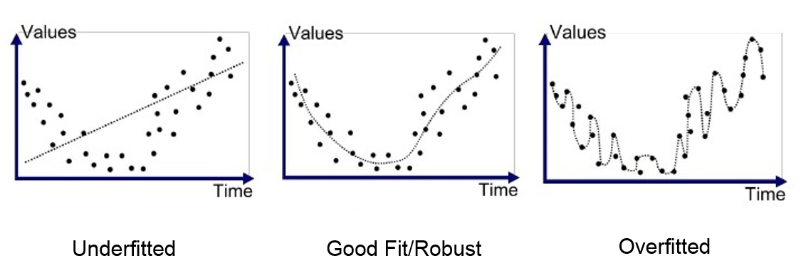

# Desarrollo de modelos

En primer lugar, consideramos el proceso usual de construcción de métodos predictivos 
con aprendizaje automático [@ESL], [@kuhn]:

1. Preprocesamiento y limpieza de datos
2. Entrenamiento o ajuste de métodos de predicción
3. Estimación de métricas de error y selección de predictores
4. Validación final de predictor seleccionado

Esto generalmente involucra al menos dos muestras (1 y 2), y de preferencia tres:

* Datos de entrenamiento: Subconjunto de los datos utilizados para entrenar el modelo.
* Datos de validación: Subconjunto de los datos con los que se evalúa el entrenamiento de forma iterativa. 
* Datos de prueba: Subconjunto de los datos que se deben de mantener ocultos hasta después de seleccionar el modelo y son usados para confirmar los resultados. 


## Ausencia y errores de validación

Uno de los primeros errores graves en este proceso es la no consideración de
etapas robustas de validación y prueba de los modelos

### Ausencia o tamaño inadecuado de muestras de validación
```{block2, type='rmdnote'}
Los resultados de la construcción de modelos se presentan según su desempeño
con el conjunto de datos que se usó para entrenarlos. Las métricas de desempeño, en 
este caso, en general no pueden utilizarse para evaluar el verdadero comportamiento del
modelo para las nuevas muestras con las que se pretende usar. 
  
```

Este problema de validación inexistente o pobre ocurre muchas veces con **pronósticos de series de tiempo**, donde 
generalmente tenemos poca información a futuro para garantizar buen desempeño, o se trata de procesos altamente dinámicos
que son en cualquier escenario difíciles de predecir. Argumentos teóricos requieren cuidado adicional, y sus supuestos deben ser evaluados. Casos particulares como el de series de tiempo requiere de estrategias de validación adaptadas (ver por ejemplo @hyndman).


```{block2, type='rmdtip'}
**Medidas de mitigación: ausencia de muestras de validación**

- (Cuantitativa 1) Construir muestras de validación y prueba preparadas adecuadamente. Esto incluye tamaño apropiado para estimar el error con precisión razonable.
  - La construcción de la muestra de validación debe ser producida idealmente bajo un diseño muestral que permita
  inferencia a la población objetivo (@lohr). 
    - La muestra de validación debe cubrir a subgrupos de interés y protegidos, de manera que
  sea posible hacer inferencia a sus subpoblaciones. Eso incluye tamaños de muestras adecuados según
  metodología de muestreo (ver @lohr).
    - Si no está disponible tal muestra, es **indispensable** un análisis de riesgos y limitaciones de la muestra naturales, conducida por expertos y personas que conozcan el proceso que generó esos datos muestrales.

- (Cuantitativa 2) Estimar el error de estimación para las medidas de desempeño sobre validación y prueba. Existen estrategias de remuestreo o consideraciones estadísticas teóricas fundamentadas para justificar la generalización del desempeño en entrenamiento.

- (Cuantitativa) Aunque los modelos pueden construirse con varias fuentes 
de datos, diseñadas o naturales, 
la **validación** debe llevarse a cabo idealmente con una muestra diseñada que permita 
inferencia estadística a la población objetivo. La muestra de validación debe cubrir
apropiadamente la población objetivo y subpoblaciones protegidas.


```


## Fugas de información

Las fugas de información [@kaufman] ponen en duda la validación de modelos como manera de estimar el desempeño en producción de los métodos de aprendizaje automático. Esto ocurre de dos maneras:

*	Fugas de entrenamiento-validación: La muestra de entrenamiento recibe *fugas* de los datos de validación, lo que implica el uso de datos de validación en entrenamiento e invalida la estimación del error de predicción.

*	Fugas de datos no disponibles en la predicción: Muestras de validación y entrenamiento tienen agrupaciones temporales o de otro tipo que no se conservan en el proceso de entrenamiento y validación. En este caso, entrenamiento y validación recibe *fugas* de información que no estará disponible el momento de hacer predicciones.

```{block2, type = 'rmdnote'}
**Reto: fugas entrenamiento validación**

Si alguna parte de los datos de validación/prueba se utiliza en la construcción de los modelos durante entrenamiento, la muestra de validación prueba no cumple su función de dar una estimación realista del error en producción.

```

```{block2, type='rmdtip'}
**Medidas de mitigación: fugas entrenamiento validación**

Cualquier procesamiento y preparación de datos de entrenamiento debe evitar usar los datos de validación o prueba de ninguna manera. Se debe mantener una barrera sólida entre entrenamiento vs validación y prueba.
  
```  


Esto incluye recodificación de datos, normalizaciones, selección de variables, identificación de datos atípicos y cualquier otro tipo de preparación de cualquier variable a ser incluida en los modelos. Esto incluye también 
ponderaciones o balance de muestras basados en sobre/sub muestreo.


#### Ejemplo {-}

Validación cruzada con selección de variables usando todos los datos [@ESL] (ver ejemplo de apéndice) 
Las fugas de datos pueden ocurrir también al momento de poner en producción:

### Fugas de datos no disponbiles en la predicción

```{block2, type='rmdnote'}
Algunos modelos son riesgosos de poner en producción 
pues utilizan variables en entrenamiento y validación que no estarán disponibles 
en la misma forma al momento de poner en producción. Esto generalmente
tiene ver con temporalidad de los datos o agrupaciones particulares.

```


En el caso más extremo, aunque quizá más fácil de detectar, existen variables
presentes en datos de entrenamiento que no estarán disponibles en producción
(por ejemplo, cantidad impagada si estamos haciendo predicción de impago). **En casos
más sutiles este error puede ser difícil de detectar**.

Pongamos como ejemplo un modelo que hace predicción de actividad criminal en distintas zonas geográficas, supongamos que el modelo utiliza como variable de entrada el número de unidades de policía que atendieron la zona de interés al tiempo $t$. Sin embargo, en esta ciudad los datos de presencia policial no están disponibles hasta un periodo posterior $t+1$. Este modelo tendría una fuga de datos no disponibles en la predicción, pues al momento de predecir actividad criminal al tiempo $t$ no estará disponible las unidades de policía para ese periodo. El modelo puede parecer preciso, pero en producción su exactitud se verá considerablemente degradada.

- En entrenamiento: pueden existir variables acumuladas hasta el momento donde
se registra la variable a predecir.
- En producción: las variables están acumuladas hasta el momento donde se hacen
las predicciones. La variable a predecir ocurre en el futuro.

Este tipo de error generalmente produce modelos que parecen muy optimistas,
y ocurre de muchas maneras. 

```{block2, type='rmdtip'}
**Medida: fugas de datos no disponbiles en la predicción**

El esquema de validación debe **replicar tan cerca como sea posible** el esquema
bajo el cual se aplicarán las predicciones. Esto incluye que hay que replicar
  
- Ventanas temporales de observación y registro de variables y ventanas de predicción
- Si existen grupos en los datos, considerar si tendremos información disponible de cada grupo cuando hacemos la predicción, o es necesario predecir para nuevos grupos.

```

#### Ejemplo (Mitigación) {-}

Supongamos que queremos predecir, en varias regiones o ciudades, el daño de edificios a partir de fotos aéreas después de un temblor, usando como variable respuesta peritajes de los edificios seleccionados. En la validación podríamos cometer el error de no respetar la agrupación regional, y el modelo podría parecer dar buenas predicciones. En la realidad, aplicaríamos para una región sobre la cual no tenemos información. La validación debe considerar la necesidad de predecir para puntos en regiones enteras sin tener información adicional de tal región (es decir, la validación debe estratificar por región). 


## Clasificación: probabilidades y clases

### Reto: Métricas de evaluación engañosas 
En problemas de clasificación, los puntos de corte o decisiones de clasificación se toman con criterios vagamente relacionados con el contexto de la decisión. La mayoría se construye mediante el análisis de la matriz de confusión de clasificación.


|                           ||                      Real                      ||
|:-------|:------------------|-----------------------:|-----------------------:|
|                           ||      Positivos         |        Negativos       |
|:-------|:------------------|-----------------------:|-----------------------:|
|Predicho|    Positivo       | Verdadero Positivo (VP)|   Falso Positivo   (FP)|
|        |    Negativo       | Falso Negativo     (FN)| Verdadero Negativo (VN)|


1. Exactitud (Accuracy): Una de las métrica más utilizadas para evaluar los modelos de clasificación y es la fracción de las predicciones que el modelo tuvo correctas. Sin embargo, la precisión puede resultar muy engañosa cuando hay desbalance de clases.  

$$\text{Exactitud} = \frac{\text{ VP+VN }}{\text{ VP + VN + FP + FN}}$$

2. Precisión: Porcentaje de aquellos clasificados como positivos por el modelo que en realidad eran positivos.

$$\text{Precision} = \frac{VP}{VP+FP}$$

3. sensibilidad (Recall): Porcentaje de positivos que el modelo clasificó correctamente.

$$\text{Sensibilidad} = \frac{VP}{VP+FN}$$

Sin embargo, estos criterios pueden ser muy engañosos dependiendo de la composición de la base de datos de entrenamiento y evaluación principalmente con datos desbalanceados donde una exactitud de 95% puede en realidad ser un modelo muy malo.

Adicionalmente el criterio que se debe de priorizar siempre deberá de ser analizado en función del contexto del problema a resolver. Por ejemplo, si el modelo está clasificando la prevalencia de una enfermedad mortal, el costo de no diagnosticar la enfermedad de una persona enferma es mucho mayor que el coste de enviar a una persona sana a más pruebas. Por esa razón se recomienda el uso de análisis costo beneficio ya que compara el resultado del modelo en el contexto de la toma de decisión. 

```{block2, type='rmdtip'}
**Medida de mitigación: Métricas de evaluación engañosas**
- Cuestionar las implicaciones de los diferentes tipos de errores, así como la forma correcta de evaluarlos.

```


### Reto: Puntos de corte arbitrario

En problemas de clasificación, los puntos de corte o decisiones de clasificación se toman con criterios vagamente relacionados con el contexto de la decisión (por ejemplo, escogiendo una sensibilidad o especificidad dadas).
Muchas veces se toma erróneamente un punto de corte de 1/2 para clasificación binaria, por ejemplo, esto sucede mucho en sistemas de soporte de decisión para focalización. Esta decisión se toma fuera del contexto de la decisión que se quiere tomar y puede tener implicaciones importantes.


```{block2, type='rmdtip'}
**Medida de mitigación: puntos de corte arbitrario**

- En problemas de clasificación ruidosos (no es posible acercarse a tener certidumbre para muchos casos), las **probabilidades de clasificación** en cada clase son instrumentos más apropiados para la toma de decisiones.
- Análisis de costo beneficio pueden utilizarse, en combinación con las probabilidades, para tomar mejores decisiones caso por caso.

```


### Reto: Datos desbalanceados

En problemas de clasificación muchas veces se presenta el fenómeno de que algunas clases tienen representación relativamente baja (por ejemplo, clases con menos de 1% de los casos totales). Estas clases presentan dificultades considerables en los modelos predictivos, pues puede ser que tengamos poca información acerca de esas clases y sea difícil discriminarlas exitosamente de otras clases, aun cuando contemos con la información correcta.

```{block2, type='rmdnote'}
En datos con desbalance grande, los **predictores de clase** pueden tener un mal desempeño para la clase minoritaria. 
```


La solución es considerar las probabilidades de clase como salida principal:

```{block2, type='rmdtip'}
**Medidas de mitigación: desbalance de clases**
- Hacer **predicciones de probabilidad** en lugar de clase. Estas probabilidades pueden ser incorporadas al proceso de decisión posterior. Evitar puntos de corte estándar de probabilidad como 0.5, o predecir según máxima probabilidad.
- Cuando el número absoluto de casos minoritarios es muy chico, puede ser muy dificil encontrar información apropiada para discriminar esa clase. Se requiere **recolectar** más datos de la clase minoritaria. 
- Submuestrar la clase dominante (ponderando hacia arriba los casos para no perder calibración) puede ser una estrategia exitosa para reducir el tamaño de los datos y tiempo de entrenamiento.

```


#### Ejemplos {-}

- Consideremos que tenemos 1 millón de datos, 999 mil negativos y mil positivos. Puede ser buena idea submuestrar los negativos por una fracción dada (por ejemplo 10%) ponderando cada caso muestreado por 10 en el ajuste y el postproceso. 

- Consideremos que tenemos 1 millón de datos, 999,950 mil negativos y 50 positivos. Puede ser imposible discriminar apropiadamente los 50 datos positivos. Construir conjuntos de validación empeora la situación: no es posible validar el desempeño predictivo ni construir un modelo con buen desempeño.

**Observaciones**:

- Sub y sobremuestreo alteran la proporción natural de positivos y negativos en los datos. Esto quiere decir que las probabilidades obtenidas están mal calibradas y tienen menos utilidad para la toma de decisiones. 

- Es importante recordar que los procesos de sub y sobre muestreo se tienen que realizar de forma posterior a la separación de la muestra en (entrenamiento, evaluación y validación) ya que de otra forma se puede tener fuga de información.


## Subajuste y sobreajuste

Subajuste y sobreajuste ocurren cuando la información predictiva en los datos es usada de manera poco apropiada para el objetivo final del aprendizaje automatizado que es la generalización del aprendizaje y su uso en conjuntos de datos no observados en el entrenamiento. 

- **Sobreajuste**: Se da cuando el modelo sobreentrena en las particularidades de los datos de entrenamiento. Un modelo demasiado complejo para los datos disponibles tiende a capturar características no informativas como parte de la estructura predictiva. Esto se refleja muchas veces en una brecha de error grande entre entrenamiento y validación. Estos pueden ser modelos ruidosos difíciles de interpretar, y las predicciones pueden ser inestables dependiendo del conjunto de datos particular que se utilice.

-	**Subajuste**: Se da cuando agrupamos de más y damos poco peso a características individuales de los casos. Un modelo con subajuste tiende a ignorar patrones sólidos en la estructura predictiva. Esto se refleja en errores sistemáticos e identificables, por ejemplo, sub/sobre predicción sistemática para ciertos grupos o valores de las variables de entrada. 



```{block2, type='rmdnote'}
**Reto: sub y sobreajuste**

- Modelos que presentan subajuste o sobreajuste son particularmente difíciles de interpretar, y comparaciones predictivas pueden ser malas.
- Modelos subajustados pueden cometer errores sistemáticos que pueden afectar negativamente, por ejemplo, al tratamiento de grupos protegidos.
- Modelos sobreajustados pueden tener predicciones inestables que cambian mucho dependiendo de los datos, por ejemplo, con cada actualización.

```

Aunque sub y sobre ajuste puede producir resultados predictivos subóptimos, pueden producir rangos de error aceptables (según el contexto del problema, conocimiento experto, y objetivos) esto sucede sobretodo si no se diseñó una validación de forma correcta o si existe fuga de información entre los subconjuntos.


```{block2, type='rmdtip'}
**Medidas: sub y sobreajuste**

- Sobreajuste: debe evitarse modelos cuya brecha validación - entrenamiento sea grande (indicios de sobreajuste).
- Subajuste: deben checarse subconjuntos importantes de casos (por ejemplo grupos protegidos) para verificar que no existen errores sistemáticos indeseables.

```

**Ejemplo (sesgo en procesamiento de caras)**: Algunos algoritmos de preprocesamiento o afinación de fotos de caras tienden a producir caras del tipo racial que domina las datos. Este es un ejemplo de subajuste, donde en ciertos grupos raciales con menor representatividad en los datos toman demasiada información de las caras dominantes, lo cual produce sesgo para grupos de menor representatividad: las imágenes procesadas tienden a parecerse más a la del grupo dominante. 

## Errores no cuantificados y evaluación humana

En muchos casos, existirán aspectos del modelo que no son medidos por las métricas de desempeño que hemos escogido, relacionado con sesgo particular de las predicciones o desviaciones sistemáticas en las predicciones que nos deseables para la toma de decisiones.

Por ejemplo, en un sistema de búsqueda en documento que aunque tenga buen desempeño de validación en las métricas, seleccione documentos que tiendan a ser demasiado cortos, 
produzcan resultados poco útiles o imparciales para búsquedas particulares, 
o prefiera documentos de tipo promocional o propagandístico. Las razones pueden ir desde
errores de preprocesamiento (algunos atributos mal calculados), selección de atributos para
hacer las predicciones que consideran sólo una parte del problema.

### Fallas no medidas por el modelo
```{block2, type='rmdnote'}

Algoritmos o métodos predictivos producen resultados que de mala calidad según aspectos no medidos
por las métricas de validación, o que tienen mal desempeño para ciertos subconjuntos de datos no predefinidos. Esto puede
ser por varias razones:
  
- Errores de preprocesamiento en el momento de calcular predicciones.
- Tratamiento de los datos que excluyen métricas importantes para hacer predicciones de calidad o no injustas.
- Ausencia de métricas que midan cierto tipo de errores particulares graves

```

Este puede ser un problema difícil, pues por su naturaleza son errores no visibles o medidos directamente. Es necesario
descubrir estos sesgos o errores fuera del contexto técnico de evaluación, y de ser posible incluir métricas adicionales
de evaluación que consideren estos problemas.

```{block2, type='rmdtip'}
**Medidas: errores no medidos y revisión humana**

- (Cualitativa) Análisis experto de la construcción del sistema puede revelar sesgos o errores conocidos
en el área pero desconocidos para el modelador.
   
- (Cuantitiva) Esquemas de monitoreo de predicciones que permitan identificación de errores
o sesgos no medidos. Por ejemplo, se pueden usar paneles de revisores que examinen predicciones particulares y consideren si son razonables o no. Estos paneles deben ser balanceados en cuanto al tipo de usuarios que se prevén, incluyendo tomadores de decisiones si es necesario.

```


## Equidad y desempeño diferencial de predictores

Métodos basados en aprendizaje automático pueden generar predicciones, que cuando no son usadas apropiadamente
en la toma de decisiones, pueden producir resultados injustos o discriminatorios ([@boulamwini], [@barocas], [@bolukbasi]). Que pueden estar ocasionadas por todos los retos antes mencionados, tanto de la fuente y manejo de datos como de errores en el desarrollo del modelo.

Es importante recordar que la evaluación de los resultados de un sistema de toma/soporte de decisión se realiza tomando en cuenta los objetivos del tomador de decisiones que pueden ser distintos e incluso contradictorios a los objetivos desde el punto de vista del problema de aprendizaje automático. Por ejemplo, un tomador de decisiones podría sacrificar el desempeño global de un modelo para mejorar el desempeño del modelo en un subgrupo, aunque este subgrupo sea pequeño en comparación a la población en su conjunto. 

Aunque el análisis de las implicaciones éticas en los modelos de aprendizaje automatizado y la relación que estas tienen con una definición de justicia es aún un campo de estudio abierto, existe una importante literatura que busca operacionalizar definiciones matemáticas de equidad en los modelos para describir su imparcialidad o discriminación entre subgrupos y tomar decisiones que mitiguen resultados no deseados. 

### Reto: Definición de justicia algorítmica y equidad algorítmica

```{block2, type='rmdnote'}
Aún conociendo el verdadero valor de la variable que queremos predecir, las predicciones de un método dado dependen
fuertemente de una variable protegida. En particular, las tasas de error de distintos grupos de la variable protegida
pueden ser muy distintos.
```

Lo que se entiende por "justicia" puede cambiar según la cultura y/o tradición de un grupo de población dado y puede ser también específico para un proyecto o problema de política pública. Por ejemplo, para ciertos casos se pueden buscar crear políticas que busquen equidad mediante acciones afirmativas como cuotas de diversidad e inclusión y
políticas de reparación, en otros casos se puede buscar tomar decisiones equitativas bajo argumentos regionales o territoriales. Estos criterios se pueden integrar en el proceso de diseño tanto en la evaluación de los errores como en el resultado de las clasificaciones. 

La implementación de este proceso se puede separar en dos etapas importantes:

- **Definición de justicia algorítmica**:  Representación matemática de una definición de justicia específica que se incorpora en el proceso de ajuste y selección de modelo.

-	**Inequidad algorítmica**: Fallas técnicas en los modelos que producen disparidad de resultados para grupos protegidos que deben de evaluarse bajo la definición de justicia algorítmica determinada en el punto anterior.  En el caso de clasificación binaria, cuando una de las alternativas es *deseable* para los individuos (por ejemplo, calificar para un beneficio, crédito, candidatura de un trabajo, etc), esta situación de inequidad muchas veces implica que la estructura predictiva dependa [@hardt] de la información que contiene la variable protegida $A$ acerca de la variable respuesta, con el riesgo de producir sesgos injustos para este sub grupo.

### Términos {-}

- **Atributo protegido**: una característica o variable **protegida** $A$ es una para la que queremos
que se cumplan cierto criterio de equidad en las predicciones.


El objetivo del modelador es establecer lineamientos para evitar que deficiencias en los modelos produzcan disparidades indeseables según los distintos subgrupos asociados a una variable protegida $A$ (por ejemplo, $A$ puede ser género, raza, nivel de marginación). 
Para ello, es necesario tener una definición de justicia algorítmica, que puede ser una de las siguientes:


#### Omisión de variables y Paridad demográfica {-}

Dos estrategias no muy útiles para prevenir disparidades entre los grupos de $A$ son: *ignorar* la variable $A$ y
buscar *paridad demográfica* de predicciones. 

En el primer caso, se pretende eliminar la posibilidad de disparidad **no** incluyendo
la variable $A$ en el proceso de construcción de predictores. Este enfoque no resuelve el problema ya que:

- Típicamente existen otros atributos asociados a $A$ que pueden producir 
resultados similares en el entrenamiento aunque $A$ no se considere (por ejemplo, zona geográfico o código postal 
y nivel socioeconómico). 

- Puede haber razones importantes para incluir $A$ en los modelos predictivos. Por ejemplo, en
el caso de presión arterial, existe variaciones en los grupos raciales ($A$) en cuanto a predisposición a presión alta
(@hipertension), por lo tanto un modelo que evalúe riesgo sería más preciso y adecuado si incluye la variable $A$.

En el segundo caso, en *paridad demográfica* de predicciones se busca que las predicciones de los distintos grupos de $A$ sean similares: en el caso de clasificación, por ejemplo, que la tasa de positivos sea similar. Esto es poco deseable 
por sí solo: por ejemplo, si quisiéramos construir un clasificador para cierta enfermedad, consideramos que es posible que
mujeres y hombres sean afectados de manera distinta. Sin embargo, *paridad demográfica* puede ser un objetivo de los tomadores de decisiones, y eso debe tomarse en cuenta al momento de tomar la decisión asociada a la predicción. 

#### Equidad de posibilidades {-}

El concepto de **equidad de posibilidades** ([@hardt]) es uno menos dependiente de los objetivos de los tomadores de decisiones,
y se refiere al desempeño predictivo a lo largo de distintos grupos definidos por $A$. Si $Y$ es la variable que queremos
predecir, y $\hat{Y}$ es nuestra predicción, decimos que nuestra predicción satisface **equidad de posibilidades** cuando

- $\hat{Y}$ y $A$ son independientes dado el valor verdadero $Y$


Esto quiere decir que $A$ no debe influir en la predicción cuando conocemos el valor verdadero $Y$, o dicho de otra
manera: la pertenencia o no pertenencia al grupo protegido $A$ no debe influir en la probabilidad de la clasificación. 

Se considera entonces que predictores que se alejan mucho de este criterio son susceptibles de incluir disparidades asociadas a la variable protegida A. Una implicación de este criterio es:
- Bajo el supuesto de equidad de posibilidades, las tasas de error predictivo sobre cada subgrupo de $A$ son similares y para clasificación binaria las tasas de falsos positivos y de falsos negativos son similares

##### Ejemplo {-}

Supongamos que se quiere crear un sistema para la selección de beneficiarios a una beca escolar para una universidad reconocida. La institución define como como variable protegida la pertenencia a una comunidad indígena (que supondremos en este caso toma dos valores: se autodenomina indígena o no se autodenomina indígena). El predictor satisface **equidad de posibilidades** cuando tanto la tasa de falsos positivos como la de falsos negativos son iguales para personas indígenas como personas que no lo son.


#### Equidad de oportunidad:

- Bajo el supuesto de equidad de oportunidad, las tasas de falsos negativos de cada subgrupo de $A$ son similares.

En la práctica no existe una respuesta única ni una medida de justicia algorítmica que funcione para todos los problemas y en la mayoría de los casos buscar el cumplimiento de una implica no cumplir con las demás, por lo que su elección se debe de hacer en el contexto del problema y se debe de justificar sus razones. Equidad de oportunidad muchas veces es un criterio aceptable, que introduce criterios de justicia algorítmica permitiendo también optimizar otros resultados deseables.


```{block2, type='rmdtip'}
**Medidas de mitigación: Definición de justicia algorítmica**

- (Cualitativa) Identificar grupos o atributos protegidos. (por ejemplo: género, raza, nivel de marginación, etc)

- (Cualitativa) Se debe de discutir con expertos y tomadores de decisiones qué medida de justicia algorítmica se buscará seguir. 

**Medidas de mitigación: Inequidad algorítmica**

- Cuando existen atributos protegidos, debe evaluarse qué tanto se alejan las predicciones de la definición de justicia algorítmica elegida.
  
- Postprocesar adecuadamente las predicciones, si es necesario, para lograr equidad de posibilidades o oportunidad [@hardt]. En el caso de clasificación, puntos de corte para distintos subgrupos pueden ajustarse para lograr equidad de oportunidad.

- Recolectar información más relevante de subgrupos protegidos (tanto casos como características) para mejorar el desempeño
predictivo en grupos minoritarios.

```

Esto en general implica que además de la decisión tomada en función de las predicciones depende de esta métrica adicional de equidad, y no solo del análisis costo-beneficio.