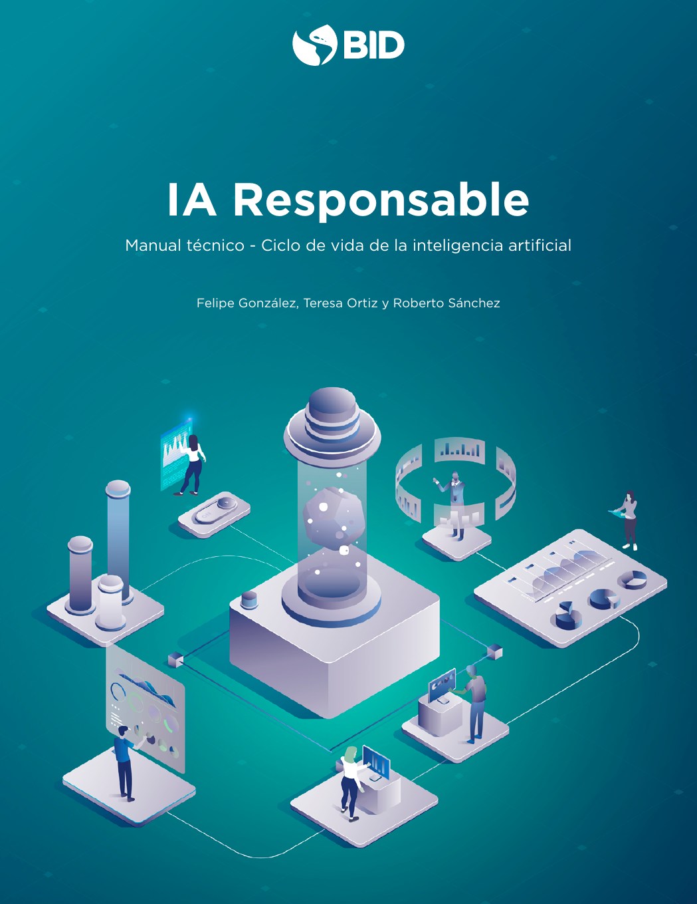

--- 
title: "IA Responsable (Ciclo de vida de IA)"
#author: "Felipe González, Teresa Ortiz, Roberto Sánchez "
#date: "`r Sys.Date()`"
output: pdf_document
description: Documento guía y cuadernos de trabajo para evaluar y mejorar el uso responsable
  de aprendizaje de máquina e Inteligencia Artifical
documentclass: book
link-citations: yes
bibliography:
- referencias.bib
- packages.bib
site: bookdown::bookdown_site
biblio-style: apalike
---


# Manual Técnico {-}

```{r cover, fig.cap="Portada Temporal", echo=FALSE, out.width="80%"}

```


## Iniciativa fAIr LAC {-}

El Banco Interamericano de Desarrollo (BID), en colaboración con socios y aliados estratégicos, lidera la iniciativa fAIr LAC mediante la cual se busca promover la adopción responsable de la Inteligencia Artificial (IA) y los sistemas de soporte de decisión para mejorar la prestación de servicios sociales y crear oportunidades de desarrollo en aras de atenuar la desigualdad social. Este manual es parte de un grupo de documentos y herramientas para equipos técnicos y responsables de la formulación de políticas públicas para guiarles en la mitigación de los retos de los sistemas de soporte de decisión y promover una adopción responsable de la IA (@fair). 


## ¿Por qué este manual? {-}

A pesar de que existe un número importante de principios que buscan una IA ética, solo proporcionan una orientación de alto nivel sobre lo que debe o no hacerse en su desarrollo y existe muy poca claridad sobre cuáles son las mejores prácticas para ponerlas en funcionamiento [@Jobin]. El objetivo de este manual es proveer esas recomendaciones y buenas prácticas técnicas con el fin de evitar resultados contrarios (muchas veces inesperados) a los objetivos de los tomadores de decisiones.  Esos fines son variados: pueden referirse a consecuencias no deseables desde el punto de vista de los tomadores de decisiones, desaprovechamiento de recursos debido a focalizaciones inadecuadas o cualquier otro objetivo que el tomador de decisiones esté buscando lograr. ^[ Este manual no pretende reglamentar o explicar cuáles deben ser los fines y objetivos de organismos y actores que toman las decisiones.]


## ¿Para quién es este manual? {-}

Este manual está pensado para equipos técnicos trabajando en la aplicación de algoritmos de aprendizaje automático para políticas públicas. Sin embargo, todos los retos que cubre son comunes a cualquier aplicación de esta tecnología.  Se asume que el lector cuenta con conocimientos básicos de estadística y programación, aunque cuando se nombran conceptos se incluyen descripciones breves y se comparte bibliografía adicional. El manual incluye cuadernillos de trabajo con varios ejemplos de los retos y soluciones explicadas. Se usan distintos tipos de modelos (lineales, basados en árboles y otros) y distintas implementaciones (R, Keras, Xgboost) para mostrar que estos problemas se presentan independientemente de la elección de herramientas particulares. Aunque los códigos y ejemplos se desarrollaron en R, todos los temas y metodologías aplicadas y descritas en este manual se pueden implementar en cualquier otro lenguaje de programación. ^[Todo el material de este documento es reproducible según instrucciones en el repositorio https://github.com/EL-BID/Manual-IA-Responsable, que contiene un archivo Dockerfile describiendo las dependencias de infraestructura para su replicación. Se utiliza el lenguaje de programación R, y los siguientes paquetes: tidyverse, recipes, themis, rsample, parsnip, yardstick, workflows, tune, knitr, patchwork.]

***

### Banco Interamericano de Desarrollo (BID) - Sector Social {-}
El Sector Social (SCL) está conformado por un equipo multidisciplinario que actúa bajo la convicción de que la inversión en las personas permite mejorar sus vidas y superar los desafíos del desarrollo en América Latina y el Caribe. Junto con los países de la región, el Sector Social formula soluciones de política pública para reducir la pobreza y mejorar la prestación de servicios de educación, trabajo, protección social y salud. El objetivo es construir una región más productiva donde predomine la igualdad de oportunidades para hombres y mujeres, y una mayor inclusión de los grupos más vulnerables. www. iadb.org/en/about-us/departments/scl 

### Banco Interamericano de Desarrollo (BID) – BID Lab {-}
BID Lab es el laboratorio de innovación del Grupo BID. Allí se movilizan financiamiento, conocimiento y conexiones para catalizar la innovación orientada a la inclusión en América Latina y el Caribe. Para BID Lab, la innovación es una herramienta poderosa que puede transformar a la región creando oportunidades sin precedentes para las poblaciones en situación vulnerable por las condiciones económicas, sociales y ambientales en que se encuentran. https://bidlab.org/ 

### Agradecimientos {-}
Por su tiempo y valiosos aportes, expresamos un agradecimiento especial a Cristina Pombo, coordinadora de la iniciativa fAIr LAC del BID y al Prof. Ricardo Baeza-Yates, Director de Ciencia de Datos en Northeastern University, Campus de Silicon Valley, e integrante del Grupo de Expertos y Expertas de fAIr LAC.

Agradecemos igualmente el apoyo prestado y los comentarios recibidos de Luis Tejerina, Elena Arias Ortiz, Natalia González Alarcón, Tetsuro Narita, Constanza Gómez-Mont, Daniel Korn, Ulises Cortés, José Antonio Guridi Bustos, Cesar Rosales y Sofia Trejo.