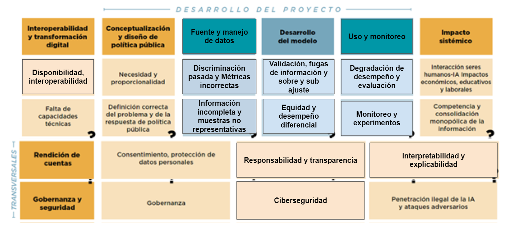

--- 
title: "AI responsable"
author: "Felipe González, Teresa Ortiz, Roberto Sánchez"
date: "`r Sys.Date()`"
output: pdf_document
description: Documento guía y cuadernos de trabajo para evaluar y mejorar el uso responsable
  de aprendizaje de máquina e Inteligencia Artifical
documentclass: book
link-citations: yes
bibliography:
- referencias.bib
- packages.bib
site: bookdown::bookdown_site
biblio-style: apalike
---

# Acerca de este material

## Iniciativa fAIr LAC

El BID, en colaboración con socios y aliados estratégicos, lidera la iniciativa fAIr LAC mediante la cual se busca promover la adopción responsable de la IA y los sistemas de soporte de decisión para mejorar la prestación de servicios sociales y crear oportunidades de desarrollo en aras de reducir las brechas y atenuar la creciente desigualdad social.

Trabajando en conjunto con los sectores público y privado, la sociedad civil y la academia, la iniciativa fAIr LAC está desarrollando guías y directrices y ejecutando experimentos y proyectos piloto de sistemas de IA.

Este manual es parte de un grupo de herramientas y guias para equipos técnicos y responsables de la formulación de políticas públicas para guiarles en la mitigación de los retos de la IA y lograr una adopción responsable y este manual se concentra en oos retos de "Manejo de datos", "desarrollo de modelo", "uso y toma de decisión" y "explicabilidad e interoperabilidad". Si te interesa conocer más sobre esta iniciativa visita [página web (temporal)](https://dev-fairlac.pantheonsite.io/)

## ¿Para quién es este manual?

Este manual está pensado para equipos técnicos trabajando en problemas de ciencia de datos aplicados a política pública. Sin embargo, todos los retos que cubre este manual son comunes a cualquier aplicación de ciencia de datos. 

Si no has tenido un curso de introducción a la estadística podrías no conocer algunos de los conceptos, pero no te preocupes se incluirán descripciones breves y compartiremos bibliografía adicional para que investigues por tu cuenta.

Los códigos de ejemplo se desarrollarán en R, si utilizas otro lenguaje para programar no te preocupes, todos los temas que tocaremos aquí se pueden implementar en cualquier otro lenguaje de programación. 

Este material es reproducible según instrucciones en [este repositorio](https://github.com/EL-BID).